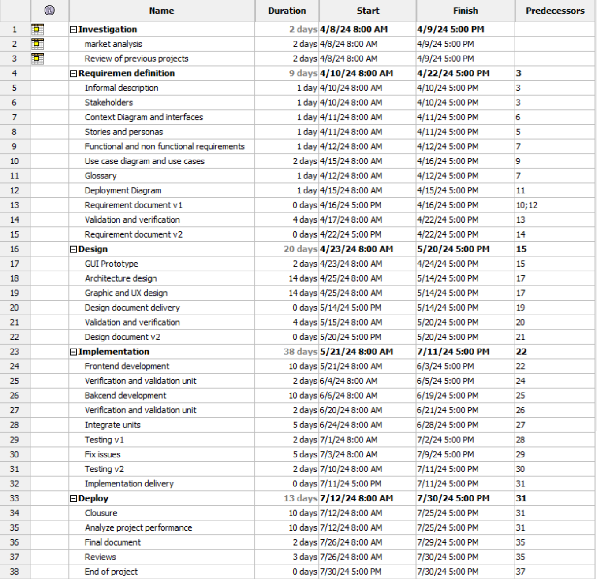
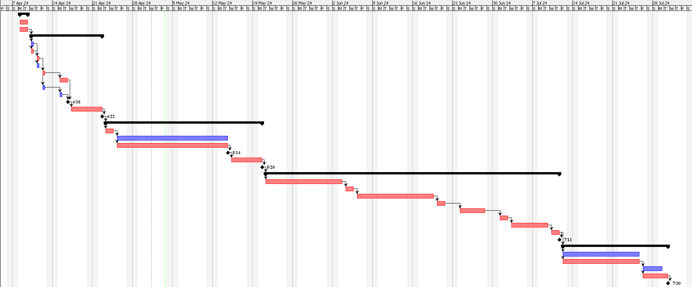

# Project Estimation - FUTURE
Date: 05/05/2024

Version: 2

# Estimation approach
Consider the EZElectronics  project in FUTURE version (as proposed by your team in requirements V2), assume that you are going to develop the project INDEPENDENT of the deadlines of the course, and from scratch (not from V1)
# Estimate by size
### 
|  | Estimate |
| ----------- | --- |  
| NC =  Estimated number of classes to be developed   | 60 classes |             
|  A = Estimated average size per class, in LOC   | 110 LOC | 
| S = Estimated size of project, in LOC (= NC * A) | 6600 |
| E = Estimated effort, in person hours (here use productivity 10 LOC per person hour)  | 660 |   
| C = Estimated cost, in euro (here use 1 person hour cost = 30 euro) | 19800 **€** | 
| Estimated calendar time, in calendar weeks (Assume team of 4 people, 8 hours per day, 5 days per week ) | 3.75 calendar weeks|               

# Estimate by product decomposition
### 
| component name | Estimated effort (person hours) |             
| ----------- | --- | 
|requirement document | 65 |
| GUI prototype | 15 |
|design document | 60 |
|code | 660 |
| unit tests | 150 |
| api tests | 70 |
| management documents  | 40 |

# Estimate by activity decomposition

# Summary

Report here the results of the three estimation approaches. The  estimates may differ. Discuss here the possible reasons for the difference

| | Estimated effort | Estimated duration |          
| --- | --- | ---------------|
| estimate by size | 660 person hours | 3.75 calendar weeks | 
| estimate by product decomposition | 1060 | 6.625 calendar weeks |
| estimate by activity decomposition | 2.560 person hours | 16 calendar weeks |
