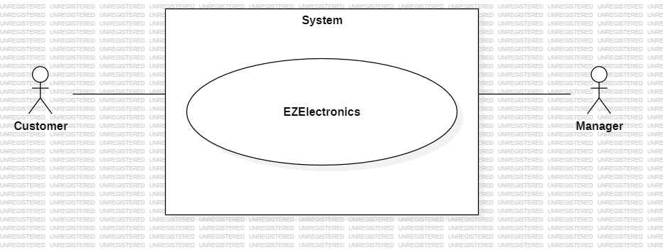
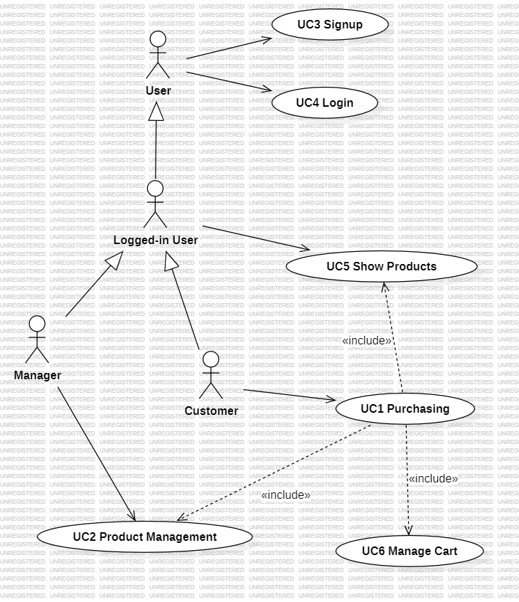
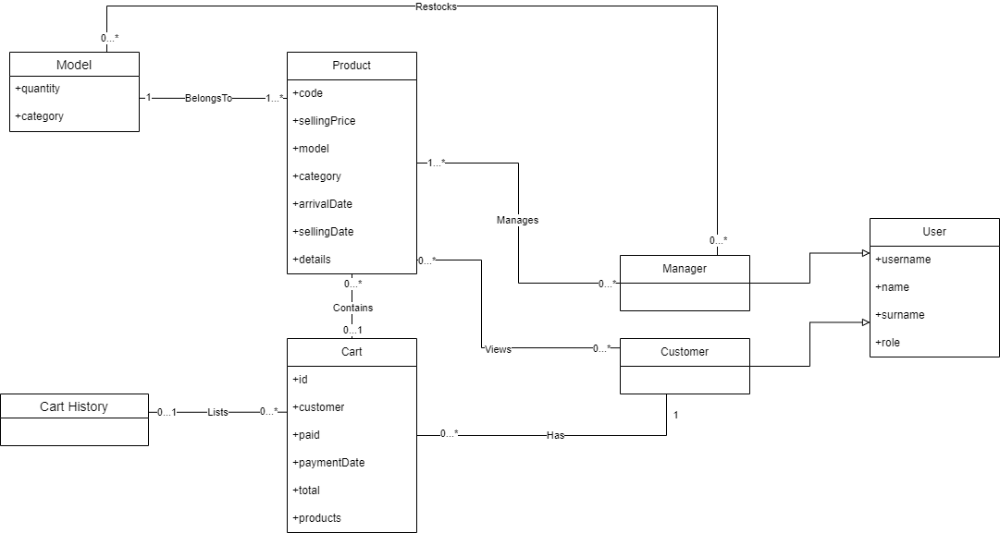
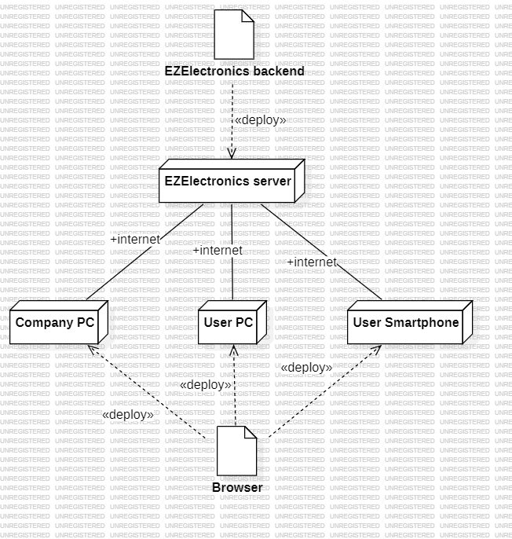

# Requirements Document - current EZElectronics

Date: 17/04/2024

Version: V1 - description of EZElectronics in CURRENT form (as received by teachers)

| Version number | Change |
| :------------: | :----: |
|       1        |   1    |

# Contents

- [Requirements Document - current EZElectronics](#requirements-document---current-ezelectronics)
- [Contents](#contents)
- [Informal description](#informal-description)
- [Stakeholders](#stakeholders)
- [Context Diagram and interfaces](#context-diagram-and-interfaces)
  - [Context Diagram](#context-diagram)
  - [Interfaces](#interfaces)
- [Stories and personas](#stories-and-personas)
- [Functional and non functional requirements](#functional-and-non-functional-requirements)
  - [Functional Requirements](#functional-requirements)
  - [Non Functional Requirements](#non-functional-requirements)
- [Use case diagram and use cases](#use-case-diagram-and-use-cases)
  - [Use case diagram](#use-case-diagram)
    - [Use case 1, UC1 Purchasing](#use-case-1-uc1-purchasing)
      - [Scenario 1.1](#scenario-11---successful-purchase-from-store)
      - [Scenario 1.2](#scenario-12---customer-aborts-process)
      - [Scenario 1.3](#scenario-13---cart-composed-also-from-cart-history)
    - [Use case 2, UC2 Product Management](#use-case-2-uc2-product-management)
      - [Scenario 2.1](#scenario-21)
      - [Scenario 2.2](#scenario-22)
      - [Scenario 2.3](#scenario-23)
      - [Scenario 2.4](#scenario-24)
      - [Scenario 2.5](#scenario-25)
      - [Scenario 2.6](#scenario-26)
      - [Scenario 2.7](#scenario-27)
    - [Use case 3, UC3 Sign up](#use-case-3-uc3-sign-up)
      - [Scenario 3.1](#scenario-31)
      - [Scenario 3.2](#scenario-32)
      - [Scenario 3.3](#scenario-33)
    - [Use case 4, UC4 Login](#use-case-4-uc4-login)
      - [Scenario 4.1](#scenario-41)
      - [Scenario 4.2](#scenario-42)
      - [Scenario 4.3](#scenario-43)
    - [Use case 5, UC5 Show Products](#use-case-5-uc5-show-products)
      - [Scenario 5.1](#scenario-51)
      - [Scenario 5.2](#scenario-52)
      - [Scenario 5.3](#scenario-53)
    - [Use case 6, UC6 Manage Cart](#use-case-6-uc6-manage-cart)
      - [Scenario 6.1](#scenario-61---add-items-to-cart)
      - [Scenario 6.2](#scenario-62---add-and-remove-items-tofrom-cart)
      - [Scenario 6.3](#scenario-63---item-has-already-been-sold)
      - [Scenario 6.4](#scenario-64---item-not-found)
      - [Scenario 6.5](#scenario-65---item-is-already-in-another-cart)

- [Glossary](#glossary)
- [Deployment Diagram](#deployment-diagram)

# Informal description

EZElectronics (read EaSy Electronics) is a software application designed to help managers of electronics stores to manage their products and offer them to customers through a dedicated website. Managers can assess the available products, record new ones, and confirm purchases. Customers can see available products, add them to a cart and see the history of their past purchases.

# Stakeholders

| Stakeholder name | Description |
| :--------------: | :---------: |
| Customers | End-users of the application |
| Managers | Administrators of the IT service |

# Context Diagram and interfaces

## Context Diagram

| Actor name | Description |
| :--------------: | :---------: |
| Customers | End-users of the application |
| Managers | Administrators of the IT service |

## Interfaces

|   Actor   | Logical Interface | Physical Interface |
| :-------: | :---------------: | :----------------: |
| Customer | GUI | Smartphone/PC |
| Manager | GUI | PC |

# Stories and personas

**Persona 1**\
High income professional, male, middle age, married with children\
**Story**\
Bank employee needs a new smartphone. Accesses Shop. Adds to cart. Changes his mind. Removes product and adds new one. Pays. Waits for normal delivery.

**Persona 2**\
No income student, male, 20yo, single\
**Story**\
Student broke his lapton and tomorrow has exam. Accesses shop. Adds to cart. Pays. Waits for fast delivery.

**Persona 3**\
Tech company employee, female, 35yo\
**Story**\
Tech geek wants to explore future products. Views products. Ends session

**Persona 4**\
Female, 60yo, school teacher, married with children\
**Story**\
School teacher wants to purchase 20 tablets for his class with government bonus. Accesses shop. Adds to cart 20 of the same tablet. Pays. Waits for normal delivery.

**Persona 5**\
Professional athlete, male, 30yo, high income\
**Story**\
Athlete wants to upgrade his smart-watch. Checks out sales. Adds to cart. Pays. Waits for normal delivery.

**Persona 6**\
Clerk, female, 35yo\
**Story**\
Customer needs a new smartphone. Accesses Shop. Adds to cart. Doesn't pay yet.

# Functional and non functional requirements

## Functional Requirements

- FR1 Authorization and Authentication of Accounts
  - FR1.1 Login
  - FR1.2 Logout
  - FR1.3 Retrieve login informations
- FR2 Managing Accounts
  - FR2.1 Signup
- FR3 Managing Products
  - FR3.1 Create New Product
  - FR3.2 Register Product Arrival
  - FR3.3 Mark Product as Sold
  - FR3.4 List All Products
    - FR3.4.1 List All Products by Category
    - FR3.4.2 List All Products by Model
  - FR3.5 Retrieve product info
  - FR3.6 Delete Product
- FR4 Managing Cart
  - FR4.1 List Products in Cart
  - FR4.2 Add Product to Cart
  - FR4.3 Finalize cart purchase
  - FR4.4 List History Paid Carts
  - FR4.5 Remove Product From Cart
  - FR4.6 Delete Cart

## Non Functional Requirements

|   ID    | Type (efficiency, reliability, ..) | Description | Refers to |
| :-----: | :--------------------------------: | :---------: | :-------: |
|  NFR1   | Usability | User that has already seen an e-commerce must understand how to use the website in less than 5 minutes | User/Customer |
|  NFR2   | Usability | Manager must be able to use the product management functionalities effectively in less than 15 minutes | Manager |
|  NFR3   | Usability | Authentication (Login/Signup) should take no more than 3 minutes | All |
|  NFR4   | Efficiency | All server requests must be resolved in less than 1 second | All |
|  NFR5   | Efficiency | Every local page action should take effect in less than 0.1 seconds | All |
|  NFR5   | Reliability | No more than 1 billing error per month | Customer |
|  NFR6   | Reliability | No more than 1 error during session | Customer/Manager |
| NFR7 | Portability | Should work on Google Chrome versions later than 125.x, both on desktop and mobile | All |

# Use case diagram and use cases

## Use case diagram

### Use case 1, UC1 Purchasing

| Actors Involved  | Customer User, Manager User (only UC1.1 and UC1.4) |
| :--------------: | :------------------------------------------------------------------: |
|   Precondition   | Customer account exists and is logged in |
|  Postcondition   | None |
| Informal Description | Customer wants to purchase from the store | 
| Nominal Scenario | UC1.1 |
|     Variants     | UC1.3 |
|    Exceptions    | UC1.2 |

##### Scenario 1.1 - Successful Purchase From Store

|  Scenario 1.1  |                                                                            |
| :------------: | :------------------------------------------------------------------------: |
|  Precondition  | One Manager and one Customer have account and are logged in |
| Post condition |  Cart added to Cart History, Products marked As Sold |

|     Step#      | Customer | Manager |
| :------------: |:-----:| :-----:| 
|       1        | Show Products of Interest - FR 3.4.X | |
|       2        | Manage Cart - UC7| |
|       3        | Pay For Cart | |
|       4        | | Registers Products As Sold - FR 3.3 |

##### Scenario 1.2 - Customer Aborts Process

|  Scenario 1.2  |                                                                            |
| :------------: | :------------------------------------------------------------------------: |
|  Precondition  | Customer account exists and is logged in |
| Post condition |  Newly created Cart is deleted  |

|     Step#      | Customer | 
| :------------: |:-----:|
|       1        | Show Products of Interest - FR 3.4.X |
|       2        | Manage Cart - UC7 |
|       3        | Delete Cart - FR 4.6 |

##### Scenario 1.3 - Cart Composed Also From Cart History

|  Scenario 1.3  |                                                                            |
| :------------: | :------------------------------------------------------------------------: |
|  Precondition  | One Manager and one Customer have account and are logged in |
| Post condition |  Cart added to Cart History, Products marked As Sold |

|     Step#      | Customer | Manager |
| :------------: |:-----:| :----: |
|       1        | Show Cart History - FR 4.4 | |
|       2        | Show Products of Interest - FR 3.4.X | |
|       3        | Manage Cart - UC7 | |
|       4        |  Pay For Cart | |
|       5        |  | Registers Products As Sold - FR 3.3 | 

### Use case 2, UC2 Product Management

| Actors Involved  | Manager |
| :--------------: | :------------------------------------------------------------------: |
|   Precondition   | User must be logged in with manager role |
|  Post condition  | Product database updated |
| Informal Description | A manager wants to update the products database |
| Nominal Scenario | UC2.1 |
|     Variants     | UC2.3, UC2.4, UC2.6 |
|    Exceptions    | UC2.2, UC2.5, UC2.7 |

##### Scenario 2.1

|  Scenario 2.1  | Create new product |
| :------------: | :------------------------------------------------------------------------: |
|  Precondition  | Manager is logged in |
| Post condition | A new product is registered in the system |

|     Step#      | Manger | System |
| :------------: |:-----:| :----: |
|       1        | Request to add a new product - FR3.1 | |
|       2        | | Add the product and returns its code |

##### Scenario 2.2

|  Scenario 2.2  | Create new product - Code error |
| :------------: | :------------------------------------------------------------------------: |
|  Precondition  | Manager is logged in |
| Post condition | An error is returned and the product is not added |

|     Step#      | Manager | System |
| :------------: |:-----:| :----: |
|       1        | The manager requests to add a new product FR3.1 | |
|       2        | | The product already exists and the system returns error 409 |

##### Scenario 2.3

|  Scenario 2.3  | Restock |
| :------------: | :------------------------------------------------------------------------: |
|  Precondition  | Manager is logged in |
| Post condition | The specified product quantity is updated |

|     Step#      | Manager | System |
| :------------: |:-----:| :----: |
|       1        | The manager requests to update the product quantity FR3.2 | |
|       2        | | The system returns nothing and updates the information |

##### Scenario 2.4

|  Scenario 2.4  | Mark a product as sold |
| :------------: | :------------------------------------------------------------------------: |
|  Precondition  | Manager is logged in |
| Post condition | The specific product is no longer availabe for sale |

|     Step#      | Manager | System |
| :------------: |:-----:| :----: |
|       1        | The manager requests to mark a product as sold FR3.3 | |
|       2        | | The system returns nothing and updates the information |

##### Scenario 2.5

|  Scenario 2.5  | Mark a product as sold - Wrong product code |
| :------------: | :------------------------------------------------------------------------: |
|  Precondition  | Manager is logged in |
| Post condition | An error is returned and nothing changes in the database |

|     Step#      | Manager | System |
| :------------: |:-----:| :----: |
|       1        | The manager requests to mark a product as sold FR3.3 | |
|       2        | | The system returns error 404 because the product code doesn't match with the database |

##### Scenario 2.6

|  Scenario 2.6  | Deleting a product |
| :------------: | :------------------------------------------------------------------------: |
|  Precondition  | Manager is logged in |
| Post condition | The product is no longer on the system |

|     Step#      | Manager | System |
| :------------: |:-----:| :----: |
|       1        | The manager requests to delete a product FR3.6 | |
|       2        | | The system returns nothing and the product is deleted |

##### Scenario 2.7

|  Scenario 2.7  | Deleting a product - Wrong product code |
| :------------: | :------------------------------------------------------------------------: |
|  Precondition  | Manager is logged in |
| Post condition | An error is returned and the product is still on the system |

|     Step#      | Manager | System |
| :------------: |:-----:| :----: |
|       1        | The manager requests to delete a product FR3.6 | |
|       2        | | The system returns error 404 because the product code doesn't match with the database |

### Use case 3, UC3 Sign Up

| Actors Involved  | User (not logged-in), System |
| :--------------: | :--------: |
|   Precondition   | User does not have an account |
|  Post condition  | Account created |
| Informal description | A user wants to create an account |
| Nominal Scenario | UC3.1 |
|     Variants     | None |
|    Exceptions    | UC3.2, UC3.3 |

##### Scenario 3.1
|  Scenario 3.1  | Create Account |
| :------------: | :-: |
|  Precondition  | User does not have an account |
| Postcondition | Account created |

|     Step#      | User (not logged-in)  | System |
| :------------: |:-----:| :----: |
| 1 | User fills in: username, name, surname, password, role | |
| 2 | | System checks that all required spaces are filled |
| 3 | | Systems checks and confirms that the username does not already exist |
| 4 | | Account is created |

##### Scenario 3.2
|  Scenario 3.2  | Username already exists |
| :------------: | :-: |
|  Precondition  | User does not have an account |
| Post condition | An error is returned and the account is not created |

|     Step#      | User (not logged-in) | System |
| :------------: |:-----:| :----: |
| 1 | User fills in: username, name, surname, password, role | |
| 2 | | System checks that all required spaces are filled |
| 3 | | Systems checks that the username does not already exist |
| 4 | | The username is already in the database |
| 5 | | The system returns a 409 error |

##### Scenario 3.3
|  Scenario 3.3  | User doesn't fills every required field |
| :------------: | :-: |
|  Precondition  | User does not have an account |
| Post condition | An error is returned and the account is not created |

|     Step#      | User (not logged-in) | System |
| :------------: |:-----:| :----: |
| 1 | User fills in: username, name, surname, password, role | |
| 2 | | System checks that all required spaces are filled |
| 3 | | System found that one required parameter is empty |
| 4 | | The system returns error 422 |

### Use case 4, UC4 Login

| Actors Involved  | Customer and Manager (User)|
| :--------------: | :--------: |
|   Precondition   | User has an account |
|  Post condition  | User is logged in on his account |
| Informal description | User wants to access his account |
| Nominal Scenario | UC4.1 |
|     Variants     | UC4.4 |
|    Exceptions    | UC4.2, UC4.3 |

##### Scenario 4.1
|  Scenario 4.1  | Login to account |
| :------------: | :-: |
|  Precondition  | User has an account |
| Post condition | User accesses his account |

|     Step#      | User | System |
| :------------: |:-----:| :----: |
| 1 | User fills in: username, password | |
| 2 | | System checks and confirms that username exists |
| 3 | | System checks and confirms that password is correct |
| 4 | | User accesses his account |

##### Scenario 4.2
|  Scenario 4.2  | Username does not exist |
| :------------: | :-: |
|  Precondition  | None |
| Post condition | User receives error |

|     Step#      | User | System |
| :------------: |:-----:| :----: |
| 1 | User fills in: username, password | |
| 2 | | System checks that username exists |
| 3 | | System throws an error (code unspecified) because username is not in the database |

##### Scenario 4.3
|  Scenario 4.3  | Password is not correct |
| :------------: | :-: |
|  Precondition  | User has an account |
| Post condition | User receives error |

|     Step#      | User | System |
| :------------: |:-----:| :----: |
| 1 | User fills in: username, password | |
| 2 | | System checks and confirms that username exists |
| 3 | | System checks that password is correct |
| 4 | | Systems throws an error (code unspecified) because password does not match the database |

### Use case 5, UC5 Show Products

| Actors Involved  | User, System |
| :--------------: | :--------: |
|   Precondition   | User is logged in |
|  Post condition  | A list of all products is shown |
| Informal Description | User wants to view a list of products|
| Nominal Scenario | UC5.1 |
|     Variants     | UC5.2, UC5.3 |
|    Exceptions    | None |

##### Scenario 5.1
|  Scenario 5.1  | Show All Products |
| :------------: | :-: |
|  Precondition  | User is logged in |
| Post condition | A list of all products is shown |

|     Step#      | User | System |
| :------------: | :-: | :-: |
| 1 | User requests list of all products | |
| 2 | | System shows a list of all products present in the database |

##### Scenario 5.2
|  Scenario 5.2  | Show All Products by Category|
| :------------: | :-: |
|  Precondition  | User is logged in |
| Post condition | A list of all products of the specified category is shown |

|     Step#      | User | System |
| :------------: | :-: | :-: |
| 1 | User requests the list of products by category | |
| 2 | | System shows a list of all products of the requested category present in the database |

##### Scenario 5.3
|  Scenario 5.3  | Show All Products by Model|
| :------------: | :-: |
|  Precondition  | User is logged in |
| Post condition | A list of all products of the specified model is shown |

|     Step#      | User | System |
| :------------: | :-: | :-: |
| 1 | User requests the list of products by model | |
| 2 | | System shows a list of all products of the requested model present in the database |

### Use case 6, UC6 Manage Cart
| Actors Involved  | Customer User |
| :--------------: | :------------------------------------------------------------------: |
|   Precondition   | User is logged in as customer|
|  Post condition  | Cart is created |
| Informal description | Customer user wants to manage his own cart |
| Nominal Scenario | UC6.1 |
|     Variants     | UC6.2 |
|    Exceptions    | UC6.3, UC6.4, UC6.5 |

##### Scenario 6.1 - Add items to Cart

|  Scenario 6.1 |                                                                            |
| :------------: | :------------------------------------------------------------------------: |
|  Precondition  | User has account and is logged in |
| Post condition | Cart is created and has at least one item |

|     Step#      | Customer | System |
| :------------: |:-----:| :----: |
|       1        | Add To Cart | |
|       2        | | Show Cart |

##### Scenario 6.2 - Add and remove items to/from cart

|  Scenario 6.2  |                                                                            |
| :------------: | :------------------------------------------------------------------------: |
|  Precondition  | User has account and is logged in |
| Post condition | Cart is created and has at least one item |

|     Step#      | Customer | System |
| :------------: |:-----:| :----: |
|       1        | Add To Cart |
|       2        | | Show Cart |
|       3        | Delete Product From Cart | |

##### Scenario 6.3 - Item has already been sold

|  Scenario 6.3 |                                                                            |
| :------------: | :------------------------------------------------------------------------: |
|  Precondition  | User has account and is logged in |
| Post condition | Return error 409 |

|     Step#      | Customer | System |
| :------------: |:-----:| :----: |
|       1        | Add To Cart |
|       2       | | Item "Sell Date" is smaller than "Current Date" |
|       3       | | Return error 409 |

##### Scenario 6.4 - Item Not Found

|  Scenario 6.4 |                                                                            |
| :------------: | :------------------------------------------------------------------------: |
|  Precondition  | User has account and is logged in |
| Post condition | Return error 404 |

|     Step#      | Actor | System |
| :------------: |:-----:| :----: |
|       1        | Add To Cart |
|       2       | | Item Is not in the database |
|       3       | | Return error 404 |

##### Scenario 6.5 - Item is already in another cart

|  Scenario 6.5 |                                                                            |
| :------------: | :------------------------------------------------------------------------: |
|  Precondition  | User has account and is logged in |
| Post condition | Return error 409 |

|     Step#      | Actor | System |
| :------------: |:-----:| :----: |
|       1        | Add To Cart |
|       2       | | Item is already in another cart |
|       3       | | Return error 409 |

# Glossary

- **Product:**
  - Electronic device sold by an electronics store.
- **Electronics store:**
  - Ecommerce where electronic devices are sold to the customers.
- **User - customer:**
  - Special user that can buy products.
- **User - Manager:**
  - Special user that manages the products and their information.
- **Cart:**
  - Virtual list filled with the products that the customer wants to buy and a summary of the total price.

# Deployment Diagram

