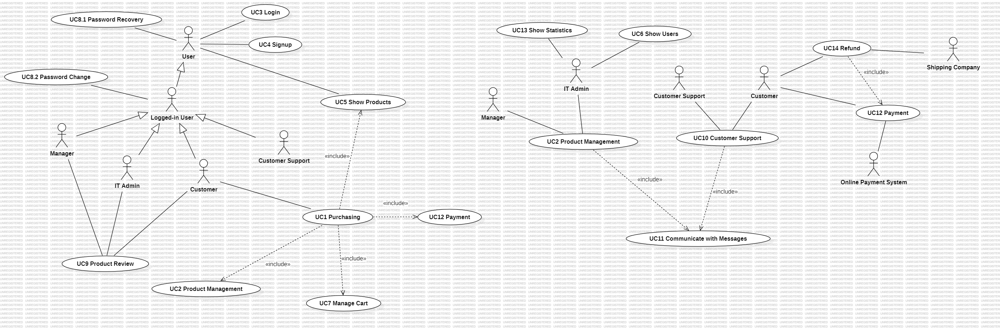

# Requirements Document - future EZElectronics

Date: 02/05/2024

Version: V2 - description of EZElectronics in FUTURE form

| Version number | Change |
| :------------: | :----: |
|       1        |    1   |

# Contents

- [Requirements Document - future EZElectronics](#requirements-document---future-ezelectronics)
- [Contents](#contents)
- [Informal description](#informal-description)
- [Stakeholders](#stakeholders)
- [Context Diagram and interfaces](#context-diagram-and-interfaces)
  - [Context Diagram](#context-diagram)
  - [Interfaces](#interfaces)
- [Stories and personas](#stories-and-personas)
- [Functional and non functional requirements](#functional-and-non-functional-requirements)
  - [Functional Requirements](#functional-requirements)
  - [Non Functional Requirements](#non-functional-requirements)
- [Use case diagram and use cases](#use-case-diagram-and-use-cases)
  - [Use case diagram](#use-case-diagram)
    - [Use case 1, UC1 Purchasing](#use-case-1-uc1-purchasing)
      - [Scenario 1.1 Successful Purchase](#scenario-11---successful-purchase-from-store)
      - [Scenario 1.2 Failed Payment](#scenario-12---payment-fails)
      - [Scenario 1.3 Purchase Aborted](#scenario-13---customer-aborts-processs)
      - [Scenario 1.4 Purchase With Points](#scenario-14---successful-purchase-with-points-used-for-discount)
      - [Scenario 1.5 Purchase From Cart History](#scenario-15---cart-composed-also-from-cart-history)
    - [Use case 2, UC2 Product Management](#use-case-2-uc2-product-management)
      - [Scenario 2.1 Create New Product](#scenario-21)
      - [Scenario 2.2 Create New Product - Code Error](#scenario-22)
      - [Scenario 2.3 Restock](#scenario-23)
      - [Scenario 2.4 Mark Product As Sold - Code Error](#scenario-24)
      - [Scenario 2.5 Delete Product](#scenario-25)
      - [Scenario 2.6 Delete Product - Code Error](#scenario-26)
      - [Scenario 2.7 Add Discount](#scenario-27)
      - [Scenario 2.8 Remove Discount](#scenario-28)
    - [Use case 3, UC3 Sign up](#use-case-3-uc3-sign-up)
      - [Scenario 3.1 Create Account](#scenario-31)
      - [Scenario 3.2 Username Already Exist](#scenario-32)
      - [Scenario 3.3 Email Already Exist](#scenario-33)
    - [Use case 4, UC4 Login](#use-case-4-uc4-login)
      - [Scenario 4.1 Login](#scenario-41)
      - [Scenario 4.2 Username Doesn't Exist](#scenario-42)
      - [Scenario 4.3 Wrong Password](#scenario-43)
    - [Use case 5, UC5 Show Products](#use-case-5-uc5-show-products)
      - [Scenario 5.1 All Products](#scenario-51)
      - [Scenario 5.2 By Category](#scenario-52)
      - [Scenario 5.3 By Model](#scenario-53)
      - [Scenario 5.4 Discounted](#scenario-54)
      - [Scenario 5.5 Sorted](#scenario-55)
    - [Use case 6, UC6 Show users](#use-case-6-uc6-show-users)
      - [Scenario 6.1 All Users](#scenario-61)
      - [Scenario 6.2 By Role](#scenario-62)
      - [Scenario 6.3 User With Username](#scenario-63)
      - [Scenario 6.4 Username Not Found](#scenario-64)
    - [Use case 7, UC7 Manage Cart](#use-case-7-uc7-manage-cart)
      - [Scenario 7.1 Add Items](#scenario-71---add-items-to-cart)
      - [Scenario 7.2 Add And Remove Items](#scenario-72---add-and-remove-items-tofrom-cart)
    - [Use case 8, UC8 Change Password](#use-case-8-uc8-password-change)
      - [Scenario 8.1 Recovery](#scenario-81---password-recovery)
      - [Scenario 8.2 Change](#scenario-82---password-change)
      - [Scenario 8.3 Username Not Found](#scenario-83---password-recovery-with-non-existant-username)
      - [Scenario 8.4 Old Password Incorrect](#scenario-84---password-change-with-wrong-old-password)
    - [Use case 9, UC9 Review Product](#use-case-9-uc9-product-review)
      - [Scenario 9.1 Add Review](#scenario-91)
      - [Scenario 9.2 See Review(s)](#scenario-92)
      - [Scenario 9.3 Delete Review](#scenario-93)
      - [Scenario 9.4 Add Rating](#scenario-94)
      - [Scenario 9.5 See Rating(s)](#scenario-95)
    - [Use case 10, UC10 Customer Support](#use-case-10-uc10-customer-support)
      - [Scenario 10.1 Product Information](#scenario-101)
      - [Scenario 10.2 System Problem](#scenario-102)
    - [Use case 11, UC11 Communication](#use-case-11-uc11-communicate-with-emails)
      - [Scenario 11.1 Send Email](#scenario-111)
      - [Scenario 11.2 View Email](#scenario-112)
    - [Use case 12, UC12 Payment](#use-case-12-uc12-payment)
      - [Scenario 12.1 Payment Successful](#scenario-121---payment-successful)
      - [Scenario 12.2 Wrong Card Number](#scenario-122---wrong-card-number)
      - [Scenario 12.3 Wrong PIN](#scenario-123---wrong-pin)
      - [Scenario 12.4 Wrong Name](#scenario-124---wrong-name)
      - [Scenario 12.5 Issue Refund](#scenario-125---issue-refund)
    - [Use case 13, UC13 Show Statistics](#use-case-13-uc13-show-statistics)
      - [Scenario 13.1 Total Profit](#scenario-131)
      - [Scenario 13.2 Units Sold](#scenario-132)
      - [Scenario 13.3 Profit By Model](#scenario-133)
      - [Scenario 13.4 Profit By Category](#scenario-134)
      - [Scenario 13.5 Units Sold By Model](#scenario-135)
      - [Scenario 13.6 Units Sold By Category](#scenario-136)
    - [Use case 14, UC14 Refund](#use-case-14-uc14-refund)
      - [Scenario 14.1 Refund Successful](#scenario-141-refund-successful)
      - [Scenario 14.2 Too Late](#scenario-142-purchase-date-too-old)
      - [Scenario 14.3 Product Not Sent Back](#scenario-143-product-not-sent)

- [Glossary](#glossary)
- [Deployment Diagram](#deployment-diagram)

# Informal description

EZElectronics (read EaSy Electronics) is a software application designed to help managers of electronics stores to manage their products and offer them to customers through a dedicated website. 
- Managers can see statistics about purchases of customer, and ask to the IT admin, through emails, to compute any kind of action on products, such as inserting discounts, add products, modify or delete them. 
- Customers can see available products, sort and filter them, add them to a cart and see the history of their past purchases. Additionaly, they're also able to return products if necessary. Customers can rate products and leave reviews. For each order they get a certain amount of fidelity points, to later spend on discounts for their next orders. 
- IT Admin performs any kind of tecnical action, everything regarding the DB and the website, only after the manager asks him, he cannot perform anything on its own. He is in charge of creating employees account.
- Customer support receives emails from customers, if they're able to answer on their own they do not contact the manager. 
- All comunications are made through in-app emails. Anyone can change password from their account page and retrieve it in case they forgot it. Now registration requires also the email, because communication goes through emails, which may be accessed on the website too.

# Stakeholders

| Stakeholder name | Description |
| :--------------: | :---------: |
| Customer | End-users of the application |
| Manager | EZelectronics employee that takes decisions by communicating with all other Actors and based on infometrics |
| Online Payment System | Platform that enables the system to accept online payments |
| IT Admin | EZelectronics employee that actually operates on the system  |
| Developer | Developer of the application |
| Competitors | Other e-commerces specified in electronic goods (e.g. Unieuro)  |
| Customer Support | EZelectronics employee or contractor, in charge of assisting customer in case of issues  |
| Marketing Expert | EZelectronics employee that analyzies market and website data in order to suggest promotions |
| COO | EZelectronics senior employee that is in charge of the whole project |
| Supplier | Contracted company that provides the electronic goods sold in the website |
| Shipping Company | Contracted company responsible for product delivery to customers |
| Email System | Platform used for sending and fetching emails between users |

# Context Diagram and interfaces

## Context Diagram

| Actor name | Description |
| :--------------: | :---------: |
| Customer | End-users of the application |
| Manager | EZelectronics employee that takes decisions by communicating with all other Actors and based on infometrics |
| Online Payment System | Platform that enables the system to accept online payments |
| IT Admin | EZelectronics employee that actually operates on the system  |
| Customer Support | EZelectronics employee, contractor, in charge of assisting customer in case of issues  |
| Shipping Company | Contracted company responsible for product delivery to customers |
| Email System | Platform used for sending and fetching emails between users |

## Interfaces

|   Actor   | Logical Interface | Physical Interface |
| :-------: | :---------------: | :----------------: |
| Customer | GUI | Smartphone/PC |
| Manager | GUI | Smartphone/PC |
| IT Admin | GUI | Smartphone/PC |
| Customer Support | GUI (emails) | Smartphone/PC |
| Shipping Company | Email | Smartphone/PC |
| Online Payment System | Internet Link | API (https://static.developer.mastercard.com/content/mdes-pre-digitization/uploads/build_3.pdf) |
| Email System | Internet | API (https://developers.google.com/gmail/api/guides?hl=it) |

# Stories and personas

**Persona 1**\
High income professional, male, middle age, married with children\
**Story**\
Bank employee needs a new smartphone. Accesses Shop. Adds to cart. Changes his mind. Removes product and adds new one. Pays. Waits for normal delivery.

**Persona 2**\
No income student, male, 20yo, single\
**Story**\
Student broke his lapton and tomorrow has exam. Accesses shop. Looks at Sales Page. Adds to cart. Pays. Waits for fast delivery.

**Persona 3**\
Tech company employee, female, 35yo\
**Story**\
Tech geek wants to explore future products. Views products. Ends session

**Persona 4**\
Female, 60yo, school teacher, married with children\
**Story**\
School teacher wants to purchase 20 tablets for his class with government bonus. Accesses shop. Adds to cart 20 of the same tablet. Pays. Waits for normal delivery.

**Persona 5**\
Professional athlete, male, 30yo, high income\
**Story**\
Athlete wants to upgrade his smartwatch. Checks out sales. Adds to cart. Pays. Waits for normal delivery.

**Persona 6**\
Clerk, female, 45yo\
**Story**\
Customer needs a new smartphone. Accesses Shop. Adds to cart. Doesn't pay yet.

**Persona 7**\
Dustman, female, 23yo\
**Story**\
Customer Support receives a call from this customer. Customer informs them that they want their account deleted. Customer support contacts IT admin and reports the request.

# Functional and non functional requirements

## Functional Requirements

- FR1 Authorization and Authentication of Accounts
  - FR1.1 Login
  - FR1.2 Logout
  - FR1.3 Retrieve login informations
  - FR1.4 Change Password
    - FR1.4.1 Password Recovery
- FR2 Managing Accounts
  - FR2.1 Signup
  - FR2.2 Retrieve the users list
    - FR2.2.1 Retrieve users list by role
  - FR2.3 Retrieve login informations by username
  - FR2.4 Delete user by username
- FR3 Managing Products
  - FR3.1 Create New Product
  - FR3.2 Register Product Arrival
  - FR3.3 Mark Product as Sold
  - FR3.4 List All Products
    - FR3.4.1 List All Products by Category
    - FR3.4.2 List All Products by Model
    - FR3.4.3 List All Discounted Products
  - FR3.5 Retrieve product info
  - FR3.7 Delete Product
  - FR3.8 Set Discount For Product
  - FR3.9 Delete Discount For Product
  - FR3.10 Sort Product List By Attribute
- FR4 Managing Cart
  - FR4.1 List Products in Cart
  - FR4.2 Add Product to Cart
  - FR4.3 Pay Products in Cart
  - FR4.4 List History Paid Carts
  - FR4.5 Remove Product From Cart
  - FR4.6 Delete Cart
  - FR4.7 Request Refund
- FR5 Communication
  - FR5.1 Send Email
  - FR5.2 Send Email Notification
  - FR5.3 View Email
- FR6 Payment System
  - FR6.1 Require Payment
  - FR6.2 Send Payment Information
  - FR6.3 Validate Payment
- FR7 Statistics
  - FR7.1 Get Total Profit
    - FR7.1.1 Get Total Profit By Model
    - FR7.1.2 Get Total Profit By Category
    - FR7.1.3 Get Total Profit By Date
  - FR7.2 Get Total Units Sold
    - FR7.2.1 Get Total Units Sold By Model
    - FR7.2.2 Get Total Units Sold By Category
    - FR7.2.3 Get Total Units Sold By Date
- FR8 Reviews
  - FR8.1 Add Review
  - FR8.2 Show Reviews
  - FR8.3 Delete Review
  - FR8.4 Add Rating
  - FR8.5 Show Rating
- FR9 Shipping
  - FR9.1 Send Shipping Request
- FR10 Fidelty Program
  - FR10.1 Add Points
  - FR10.2 Spend Points

## Non Functional Requirements

\<Describe constraints on functional requirements>

|   ID    | Type (efficiency, reliability, ..) | Description | Refers to |
| :-----: | :--------------------------------: | :---------: | :-------: |
|  NFR1   | Usability | User that has already seen an e-commerce must understand how to use the website in less than 5 minutes | Customer |
|  NFR2   | Usability | Manager must be able to use the product management functionalities effectively in less than 15 minutes | IT Admin |
|  NFR3   | Usability | Authentication (Login/Signup) should take no more than 3 minutes | All |
|  NFR4   | Efficiency | All server requests must be resolved in less than 1 second | All |
|  NFR5   | Efficiency | Every local page action should take effect in less than 0.1 seconds | All |
|  NFR5   | Reliability | No more than 1 billing error per month | Customer |
|  NFR6   | Reliability | No more than 1 error during session | Customer/Manager |
|  NFR7   | Portability | Should work on Google Chrome versions later than 125.x, both on desktop and mobile | All |
|  NFR8   | Usability  | A Customer that decides to rely on Customer Support should be able to find out how in less than a minute | Customer |
|  NFR9   | Usability  | Customer should receive a solution for their problems within a day | Customer/Customer Support |

# Use case diagram and use cases

## Use case diagram

### Use case 1, UC1 Purchasing

| Actors Involved  | Customer |
| :--------------: | :------------------------------------------------------------------: |
|   Precondition   | Customer is logged in |
|  Post condition  |  |
| Nominal Scenario | UC1.1 |
|     Variants     | UC1.4, UC1.5 |
|    Exceptions    | UC1.2, UC1.3 |

##### Scenario 1.1 - Successful Purchase From Store

|  Scenario 1.1  | |
| :------------: | :--: |
|  Precondition  | Customer is logged in |
| Post condition |  Cart added to Cart History, Shipment Request Sent, Points Updated |

|     Step#      | Customer | System |
| :------------: |:-----:| :----: |
|       1        | Show Products of Interest - FR 3.4.X |
|       2       | Manage Cart - UC 7 |  |
|       3       | Pay For Cart - UC 12.1 |  |
|       4       |  | Registers Products As Sold - FR 3.3 |
|       5       |  | Add Points for Customer - FR 10.1 |
|       6       |  | Send Shipping Request - FR 9.1 |

##### Scenario 1.2 - Payment Fails

|  Scenario 1.2  |  |
| :------------: | :---: |
|  Precondition  | Customer is logged in |
| Post condition |  Newly created Cart is deleted |

|     Step#      | Customer |
| :------------: |:-----:|
|       1        | Show Products of Interest - FR 3.4.X |
|       2       | Manage Cart - UC 7 |  |
|       3       | Pay For Cart Fails - UC 12 |  |
|       4       | Delete Cart - FR 4.6 | 

##### Scenario 1.3 - Customer Aborts Process

|  Scenario 1.3  |  |
| :------------: | :--: |
|  Precondition  | Customer is logged in |
| Post condition |  Newly created Cart is deleted  |

|     Step#      | Customer |
| :------------: |:-----:|
|       1        | Show Products of Interest - FR 3.4.X |
|       2       | Manage Cart - UC 7 |  |
|       3       | Delete Cart - FR 4.6 | 

##### Scenario 1.4 - Successful purchase with points used for discount

|  Scenario 1.4  |                                                                            |
| :------------: | :------------------------------------------------------------------------: |
|  Precondition  | Customer is logged in |
| Post condition |  Cart added to Cart History, Products marked As Sold, Shipment Request Sent, Points Updated |

|     Step#      | Customer | System |
| :------------: |:-----:| :----: |
|       1        | Show Products of Interest - FR 3.4.X |
|       2       | Manage Cart - UC 7 |  |
|       3       | Spend points FR 10.2 |  |
|       4       |  | Price for cart is updated with the discount |
|       5       | Pay For Cart - UC 12.1 |  |
|       6       |  | Registers Products As Sold - FR 3.3 |
|       7       |  | Add Points for Customer - FR 10.1 |
|       8       |  | Send Shipping Request - FR 9.1 |

##### Scenario 1.5 - Cart Composed Also From Cart History

|  Scenario 1.5  |                                                                            |
| :------------: | :------------------------------------------------------------------------: |
|  Precondition  | Customer is logged in |
| Post condition |  Cart added to Cart History, Products marked As Sold, Shipment Request Sent, Points Updated |

|     Step#      | Customer | System |
| :------------: |:-----:| :----: |
|       1        | Show Cart History - FR 4.4 |
|       2       | Manage Cart - UC 7 |  |
|       3       | Show Products of Interest - FR 3.4.X |  |
|       4       | Manage Cart - UC 7 |  |
|       5       | Pay For Cart - UC 12.1 |  |
|       6       |  | Registers Products As Sold - FR 3.3 |
|       7       |  | Add Points for Customer - FR 10.1 |
|       8       |  | Send Shipping Request - FR 9.1 |

### Use case 2, UC2 Product Management

| Actors Involved  | Manager, IT Admin |
| :--------------: | :------------------------------------------------------------------: |
|   Precondition   | Manager and IT Admin are logged in |
|  Post condition  | Product database must be updated |
| Nominal Scenario | 2.1, 2.3, 2.4, 2.6, 2.7 |
|     Variants     | None |
|    Exceptions    | 2.2, 2.5 |

##### Scenario 2.1

|  Scenario 2.1  | Create new product |
| :------------: | :------------------------------------------------------------------------: |
|  Precondition  | Manager and IT Admin are logged in |
| Post condition | A new product is registered in the system |

|     Step#      | Manager | System | IT Admin |
| :------------: |:-----:| :----: | :----: |
|       1        | Communicates to IT admin to add a new product FR5 |
|       2       |  |  | Add the new product FR3.1 |
|       3       |  | Add the product and returns its code |  |
|       4       |  |  | Communicates to manager the action is successfully completed FR5 |

##### Scenario 2.2

|  Scenario 2.2  | Create new product - Code error |
| :------------: | :------------------------------------------------------------------------: |
|  Precondition  | Manager and IT Admin are logged in |
| Post condition | An error is returned and the product is not added |

|     Step#      | Manager | System | IT Admin |
| :------------: |:-----:| :----: | :----: |
|       1        | Communicates to IT admin to add a new product FR5 |
|       2       |  |  | Add the new product FR3.1 |
|       3       |  | The product already exists and it returns error 409 |  |
|       4       |  |  | Communicates to manager the action failed due to an error FR5 |

##### Scenario 2.3

|  Scenario 2.3  | Restock |
| :------------: | :------------------------------------------------------------------------: |
|  Precondition  | Manager and IT Admin are logged in |
| Post condition | The specified product quantity is updated |

|     Step#      | Manager | System | IT Admin |
| :------------: |:-----:| :----: | :----: |
|       1        | Communicates to IT admin to update the model quantity FR5 |
|       2       |  |  | Updates the product quantity FR3.2 |
|       3       |  | Returns nothing and updates the information |  |
|       4       |  |  | Communicates to manager the action is successfully completed FR5 |

##### Scenario 2.4

|  Scenario 2.4  | Deleting a product |
| :------------: | :------------------------------------------------------------------------: |
|  Precondition  | Manager and IT Admin are logged in |
| Post condition | The product is no longer on the system |

|     Step#      | Manager | System | IT Admin |
| :------------: |:-----:| :----: | :----: |
|       1        | Communicates to IT admin to delete a product FR5 |
|       2       |  |  | Deletes the product FR3.7 |
|       3       |  | Returns nothing and the product is deleted |  |
|       4       |  |  | Communicates to manager the action is successfully completed FR5 |

##### Scenario 2.5

|  Scenario 2.5  | Deleting a product - Wrong product code |
| :------------: | :------------------------------------------------------------------------: |
|  Precondition  | Manager and IT Admin are logged in |
| Post condition | Error 404 is returned and the product is still on the system |

|     Step#      | Manager | System | IT Admin |
| :------------: |:-----:| :----: | :----: |
|       1        | Communicates to IT admin to delete a product FR5 |
|       2       |  |  | Deletes the product FR3.7 |
|       3       |  | Returns error 404 because the product code doesn't match with the database |  |
|       4       |  |  | Communicates to manager the action failed due to a code error FR5 |

##### Scenario 2.6

|  Scenario 2.6  | Adding a discount to a product |
| :------------: | :------------------------------------------------------------------------: |
|  Precondition  | Manager and IT Admin are logged in |
| Post condition | The price of the specified product is updated |

|     Step#      | Manager | System | IT Admin |
| :------------: |:-----:| :----: | :----: |
|       1        | Communicates to IT admin to add a discount FR5 |
|       2       |  |  | Set the discount to the specified product FR3.8 |
|       3       |  | Updates the price and returns nothing |  |
|       4       |  |  | Communicates to manager the action is successfully completed FR5 |

##### Scenario 2.7

|  Scenario 2.7  | Deleting the discount to a product |
| :------------: | :------------------------------------------------------------------------: |
|  Precondition  | Manager and IT Admin are logged in |
| Post condition | The price of the specified product is restored |

|     Step#      | Manager | System | IT Admin |
| :------------: |:-----:| :----: | :----: |
|       1        | Communicates to IT admin to delete a discount FR5 |
|       2       |  |  | Set the price back to the original one for the specified product FR3.9 |
|       3       |  | Updates the price and returns nothing |  |
|       4       |  |  | Communicates to manager the action is successfully completed FR5 |

### Use case 3, UC3 Sign Up

| Actors Involved  |User, IT Admin|
| :--------------: | :--------: |
|   Precondition   | User does not have an account |
|  Post condition  | Account created |
| Nominal Scenario | 3.1, 3.4 |
|     Variants     | None |
|    Exceptions    | 3.2, 3.3 |

##### Scenario 3.1
|  Scenario 3.1  | Create Customer Account |
| :------------: | :-: |
|  Precondition  | User does not have an account |
| Post condition | Account created |

|     Step#      | User | System |
| :------------: |:-----:| :----: |
|       1        | Fills in: username, email, name, surname, password |
|       2       |  | Checks and confirms that username and email do not already exist |
|       3       |  | Account is created - FR2.1 |

##### Scenario 3.2
|  Scenario 3.2  | Username already exists |
| :------------: | :-: |
|  Precondition  | User does not have an account |
| Post condition | An error is returned and the account is not created |

|     Step#      | User | System |
| :------------: |:-----:| :----: |
|       1        | Fills in: username, email, name, surname, password, role |
|       2       |  | Checks that username and email do not already exist |
|       3       |  | The username is already in the database |
|       4       |  | Returns a 409 error |

##### Scenario 3.3
|  Scenario 3.3  | Email already exists |
| :------------: | :-: |
|  Precondition  | User does not have an account |
| Post condition | An error is returned and the account is not created |

|     Step#      | User | System |
| :------------: |:-----:| :----: |
|       1        | Fills in: username, email, name, surname, password, role |
|       2       |  | Checks that username and email do not already exist |
|       3       |  | The email is already in the database |
|       4       |  | Returns a 409 error |

##### Scenario 3.4
|  Scenario 3.1  | Create Employee Account |
| :------------: | :-: |
|  Precondition  | User does not have an account |
| Post condition | Account created |

|     Step#      | IT Admin | System |
| :------------: |:-----:| :----: |
|       1        | Fills in: username, email, name, surname, password, role |
|       2       |  | Checks and confirms that username and email do not already exist |
|       3       |  | Account is created - FR2.1 |

### Use case 4, UC4 Login

| Actors Involved  |User|
| :--------------: | :--------: |
|   Precondition   | User has an account |
|  Post condition  | User is logged in on his account |
| Nominal Scenario | 4.1 |
|     Variants     | None |
|    Exceptions    | 4.2, 4.3 |

##### Scenario 4.1
|  Scenario 4.1  | Login to account |
| :------------: | :-: |
|  Precondition  | User has an account |
| Post condition | User accesses his account |

|     Step#      | User | System |
| :------------: |:-----:| :----: |
|       1        | Fills in: username, password |
|       2       |  | Checks and confirms that username exists |
|       3       |  | Checks and confirms that password is correct |
|       4       | Accesses his account - FR1.1 |  |

##### Scenario 4.2
|  Scenario 4.2  | Username does not exist |
| :------------: | :-: |
|  Precondition  | None |
| Post condition | User receives error |

|     Step#      | User | System |
| :------------: |:-----:| :----: |
|       1        | Fills in: username, password |
|       2       |  | Checks that username exists |
|       3       |  | Throws an error because username is not in the database |

##### Scenario 4.3
|  Scenario 4.3  | Password is not correct |
| :------------: | :-: |
|  Precondition  | None |
| Post condition | User receives error |

|     Step#      | User | System |
| :------------: |:-----:| :----: |
|       1        | Fills in: username, password |
|       2       |  | Checks and confirms that username exists |
|       3       |  | Checks that password is correct |
|       4       |  | Throws an error because password does not match the database |

### Use case 5, UC5 Show Products

| Actors Involved  | User, System|
| :--------------: | :--------: |
|   Precondition   | None |
|  Post condition  | A list of all products is shown |
| Nominal Scenario | 5.1 |
|     Variants     | 5.2, 5.3, 5.4, 5.5 |
|    Exceptions    | None |

##### Scenario 5.1
|  Scenario 5.1  | Show All Products |
| :------------: | :-: |
|  Precondition  | None |
| Post condition | A list of all products is shown |

|     Step#      | User | System |
| :------------: |:-----:| :----: |
|       1        | Requests the ezelectronics/products page |
|       2       |  | Shows a list of all products present in the database - FR3.4 |

##### Scenario 5.2
|  Scenario 5.2  | Show All Products by Category|
| :------------: | :-: |
|  Precondition  | None |
| Post condition | A list of all products of the specified category is shown |

|     Step#      | User | System |
| :------------: |:-----:| :----: |
|       1        | Requests the ezelectronics/products/category/:category page |
|       2       |  | Shows a list of all products of the requested category present in the database - FR3.4.1 |

##### Scenario 5.3
|  Scenario 5.3  | Show All Products by Model|
| :------------: | :-: |
|  Precondition  | None |
| Post condition | A list of all products of the specified model is shown |

|     Step#      | User | System |
| :------------: |:-----:| :----: |
|       1        | Requests the ezelectronics/products/model/:model page |
|       2       |  | Shows a list of all products of the requested model present in the database - FR3.4.2 |

##### Scenario 5.4
|  Scenario 5.4  | Show All Discounted Products|
| :------------: | :-: |
|  Precondition  | None |
| Post condition | A list of all discounted products is shown |

|     Step#      | User | System |
| :------------: |:-----:| :----: |
|       1        | Requests the ezelectronics/products/discounted page |
|       2       |  | Shows a list of all discounted products present in the database - FR3.4.3 |

##### Scenario 5.5
|  Scenario 5.5  | Show Sorted List of Products|
| :------------: | :-: |
|  Precondition  | None |
| Post condition | A list sorted by the specified attribute is shown |

|     Step#      | User | System |
| :------------: |:-----:| :----: |
|       1        | Requests a page in the website with a list of products |
|       2       | Selects the sorting attribute |  |
|       3       |  | Shows the all products in the list in sorted order - FR3.10 |

### Use case 6, UC6 Show Users

| Actors Involved  | IT Admin, System|
| :--------------: | :--------: |
| Precondition | User is logged in as IT Admin |
|  Post condition  | A list of users in the database is shown |
| Nominal Scenario | 6.1 |
|     Variants     | 6.2, 6.3 |
|    Exceptions    | 6.4 |

##### Scenario 6.1
|  Scenario 6.1  | Show All Users in the database |
| :------------: | :-: |
| Precondition | User is logged in as IT Admin |
| Post condition | A list of all users is shown |

|     Step#      | IT Admin | System |
| :------------: |:-----:| :----: |
|       1        | Requests the ezelectronics/users page |
|       2        |  | Shows a list of all users present in the database - FR2.2 |

##### Scenario 6.2
|  Scenario 6.2  | Show Users in the database with specified Role |
| :------------: | :-: |
| Precondition | User is logged in as IT Admin |
| Post condition | A list of all users with specified role is shown |

|     Step#      | IT Admin | System |
| :------------: |:-----:| :----: |
|       1        | Requests the ezelectronics/users/role/:role page |
|       2        |  | Shows a list of all users with specified role present in the database - FR2.2.1 |

##### Scenario 6.3
|  Scenario 6.3  | Show User in the database with specified username |
| :------------: | :-: |
| Precondition | User is logged in as IT Admin |
| Post condition | The details of the user corresponding to the specified username are shown |

|     Step#      | IT Admin | System |
| :------------: |:-----:| :----: |
|       1        | Requests the ezelectronics/users/username/:username page |
|       2        |  | Checks and confirms that username exists in the database |
|       3        |  | Shows the details of the specified user - FR2.3 |

##### Scenario 6.4
|  Scenario 6.4 | Username not found |
| :------------: | :-: |
| Precondition | User is logged in as IT Admin |
| Post condition | The systems shows an error |

|     Step#      | User | System |
| :------------: |:-----:| :----: |
|       1        | Requests the ezelectronics/users/username/:username page |
|       2        |  | Checks that username exists in the database |
|       3        |  | Returns a 404 error |

### Use case 7, UC7 Manage Cart
| Actors Involved  | Customer User |
| :--------------: | :------------------------------------------------------------------: |
|   Precondition   | User is logged in as customer|
|  Post condition  | Cart is created |
| Informal description | Customer user wants to manage his own cart |
| Nominal Scenario | UC7.1 |
|     Variants     | UC7.2 |
|    Exceptions    | None |

##### Scenario 7.1 - Add items to Cart

|  Scenario 7.1 |  |
| :------------: | :---: |
|  Precondition  | User has account and is logged in |
| Post condition | Cart is created and has at least one item |

|     Step#      | Customer | System |
| :------------: |:-----:| :----: |
|       1        | Add To Cart - FR4.2 | |
|       2        | | Show Cart - FR4.1 |

##### Scenario 7.2 - Add and remove items to/from cart

|  Scenario 7.2  |  |
| :------------: | :---: |
|  Precondition  | User has account and is logged in |
| Post condition | Cart is created and has at least one item |

|     Step#      | Customer | System |
| :------------: |:-----:| :----: |
|       1        | Add To Cart - FR4.2 |
|       2        | | Show Cart - FR4.1 |
|       3        | Delete Product From Cart - FR4.5 | |

### Use case 8, UC8 Password Change

| Actors Involved  | User, System |
| :--------------: | :------: |
|   Precondition   | User has account or User is logged in |
|  Post condition  | User's password is changed |
| Nominal Scenario | 8.1, 8.2 |
|     Variants     | None |
|    Exceptions    | 8.3, 8.4 |

##### Scenario 8.1 - Password Recovery

| Scenario 8.1 | |
| :------------: | :--: |
|  Precondition  | User has account |
| Post condition | User's password is changed |

|     Step#      | User | System |
| :------------: |:-----:| :----: |
|       1        | Requests new password from system |
|       2        | Specifies its username |  |
|       3        |  | Checks that username specified exists in the database |
|       4        |  | Sends a link to modify the password to the verified email of the username specified |
|       5        | Clicks on the link |  |
|       6        | Is prompted for a new password |  |
|       7        |  | Updates the database with the new password - FR1.4.1 |

##### Scenario 8.2 - Password Change

| Scenario 8.2 | |
| :------------: | :--: |
|  Precondition  | User is logged in |
| Post condition | User's password is changed |

|     Step#      | User | System |
| :------------: |:-----:| :----: |
|       1        | Requests a password change to the system |
|       2        | Fills in old password and new password |  |
|       3        |  | Checks and confirms that the old password is correct |
|       4        |  | Updates the database with the new password - FR1.4 |

##### Scenario 8.3 - Password Recovery with Non-existant Username

| Scenario 8.3 | |
| :------------: | :--: |
|  Precondition  | None |
| Post condition | User's password is not changed and error is thrown |

|     Step#      | User | System |
| :------------: |:-----:| :----: |
|       1        | Requests new password from system |
|       2        | Specifies a username |  |
|       3        |  | Checks that username specified exists in the database |
|       4        |  | Throws an error because specified username does not exist |

##### Scenario 8.4 - Password Change with Wrong Old Password

| Scenario 8.4 | |
| :------------: | :--: |
|  Precondition  | User is logged in |
| Post condition | System returns an error |

|     Step#      | User | System |
| :------------: |:-----:| :----: |
|       1        | Requests a password change to the system |
|       2        | Fills in old password and new password |  |
|       3        |  | Checks that the old password is correct |
|       4        |  | Throws an error because the old password is not correct |

### Use case 9, UC9 Product Review

| Actors Involved  | User, Customer, Manager, IT Admin, System|
| :--------------: | :--------: |
|   Precondition   | None |
|  Post condition  | User retrieves or adds information |
| Nominal Scenario | 9.1, 9.2, 9.3, 9.4, 9.5 |
|     Variants     | None |
|    Exceptions    | None |

##### Scenario 9.1 

|  Scenario 9.1  | Customer adds a review to a product |
| :------------: | :--: |
|  Precondition  | Customer is logged in |
| Post condition | A new review is added to the specified product |

|     Step#      | Customer | 
| :------------: |:-----:| 
|       1        | Opens the product page FR3.5 |
|       2        | Writes and sends a review for the specified product FR8.1 |  |

##### Scenario 9.2 

|  Scenario 9.2  | User sees all reviews for a specified product |
| :------------: | :----: |
|  Precondition  | None |
| Post condition | All reviews for the product are displayed |

|     Step#      | User | System |
| :------------: |:-----:| :----: |
|       1        | Opens the product page FR3.5 |
|       2        | Asks the system to show him all reviews for that product |  |
|       3        |  | Show user reviews FR8.2 |

##### Scenario 9.3

|  Scenario 9.3  | Manager wants to delete a review |
| :------------: | :------------------------------------------------------------------------: |
|  Precondition  | Manager is logged in |
| Post condition | The review is deleted from the system |

|     Step#      | Manager | System | IT Admin |
| :------------: |:-----:| :----: | :----: |
|       1        | Requests to IT Admin to delete a specific review FR5 |
|       2        |  |  | Deletes the review |
|       3        |  | Deletes the review and returns nothing FR8.3 |
|       4        |  |  | Communicates back to the manager the review was successfully removed FR5 |

##### Scenario 9.4 

|  Scenario 9.4  | Customer wants to leave a rating for a specific product |
| :------------: | :------------------------------------------------------------------------: |
|  Precondition  | Customer is logged in |
| Post condition | Rating is registered by the system |

|     Step#      | Customer | System |
| :------------: |:-----:| :----: |
|       1        | Opens the product page FR3.5 |
|       2        | Leaves the rating |  |
|       3        |  | Registers the rating FR8.4 |

##### Scenario 9.5

|  Scenario 9.5  | User sees all ratings for a specified product |
| :------------: | :--: |
|  Precondition  | None |
| Post condition | All ratings for the product are displayed |

|     Step#      | User | System |
| :------------: |:-----:| :----: |
|       1        | Open the product page FR3.5 |
|       2        | Asks the system to show him all ratings for that product |  |
|       3        |  | Shows user all ratings for the specified product FR8.5 |

### Use case 10, UC10 Customer Support

| Actors Involved  |Customer, Manager, Customer Support, System|
| :--------------: | :--------: |
|   Precondition   | User has an account as customer and needs help |
|  Post condition  | User receives help from customer support |
| Nominal Scenario | 10.1, 10.2 |
|     Variants     | None |
|    Exceptions    | None |

##### Scenario 10.1

|  Scenario 10.1  | Customer wants informations about a specific product |
| :------------: | :------------------------------------------------------------------------: |
|  Precondition  | Customer is logged in |
| Post condition | Customer support replies to the customer with informations he needed |

|     Step#      | Customer | Customer Support |
| :------------: |:-----:| :----: |
|       1        | Sends an email to customer support asking more informations about details of a product FR5 |
|       2        |  | Receives the email and replies to the customer with informations he needs FR5 |

##### Scenario 10.2

|  Scenario 10.2  | Customer notices there is a problem in the system |
| :------------: | :-----: |
|  Precondition  | Customer is logged in |
| Post condition | Customer support informs the manager about the problem |

|     Step#      | Customer | Customer Support | Manager |
| :------------: |:-----:| :----: | :----: |
|       1        | Sends an email to customer support letting them know he noticed a problem that needs to be fixed FR5 |
|       2        |  | Receives the email and sends the manager an email to solve the problem FR5 |
|       3        |  |  | Receives the email and figures out how to fix it FR5 |

### Use case 11, UC11 Communicate with Emails

| Actors Involved  |Logged-in User, System|
| :--------------: | :--------: |
|   Precondition   | User is logged-in |
|  Post condition  | Email is sent |
| Nominal Scenario | 11.1, 11.2 |
|     Variants     | None |
|    Exceptions    | None |

##### Scenario 11.1
|  Scenario 11.1  | Send Email |
| :------------: | :-: |
|  Precondition  | User is logged-in |
| Post condition | Email is sent |

|     Step#      | User | System |
| :------------: |:-----:| :----: |
|       1        | Enters the email page |
|       2        | Selects recipient's email address |  |
|       3        | Writes email |  |
|       4        | Requests that the email is sent |  |
|       5        |  | Sends an email to recipient FR5.1 |
|       6        |  |  Sends an email notification to recipient FR5.2 |

##### Scenario 11.2
|  Scenario 11.2 | View Email |
| :------------: | :-: |
|  Precondition  | User is logged-in |
| Post condition | Emails from specified User are shown |

|     Step#      | User | System |
| :------------: |:-----:| :----: |
|       1        | Enters the email page |
|       2        | Selects sender's email address |  |
|       3        |  | Shows email from specified user FR5.3 |

### Use case 12, UC12 Payment

| Actors Involved  | Customer User, IT Admin, Online Payment System |
| :--------------: | :------------------------------------------------------------------: |
|   Precondition   | Customer User has account and is logged in, Cart exists and has > 1 item |
|  Post condition  |  |
| Nominal Scenario | UC12.1 |
|     Variants     | UC12.5 |
|    Exceptions    | UC12.2, UC12.3, UC12.4 |

##### Scenario 12.1 - Payment successful

| Scenario 12.1 |  |
| :------------: | :--: |
|  Precondition  | Those of UC12 + Online Payment System Server is responsive |
| Post condition | Payment successful |

|     Step#      | Customer | Payment System |
| :------------: |:-----:| :----: |
|       1        | Form with payment information is presented to Customer User FR6.1 |
|       2        | Fill form and confirm FR6.2 |  |
|       3        |  | Information deemed valid FR6.3 |
|       4        |  | Process Payment |
|       5        |  | Send Success Notification |

##### Scenario 12.2 - Wrong Card Number

| Scenario 12.2 |  |
| :------------: | :--: |
|  Precondition  | Those of UC12 + Online Payment System Server is responsive |
| Post condition | Payment Aborted |

|     Step#      | Customer | Payment System |
| :------------: |:-----:| :----: |
|       1        | Form with payment information is presented to Customer User FR6.1 |
|       2        | Fill form and confirm FR6.2 |  |
|       3        |  | Card with specified card number does not exist FR6.3 |
|       4        |  | Send Failure Notification |

##### Scenario 12.3 - Wrong PIN

| Scenario 12.3 |  |
| :------------: | :--: |
|  Precondition  | Those of UC12 + Online Payment System Server is responsive |
| Post condition | Payment Aborted |

|     Step#      | Customer | Payment System |
| :------------: |:-----:| :----: |
|       1        | Form with payment information is presented to Customer User FR6.1 |
|       2        | Fill form and confirm FR6.2 |  |
|       3        |  | PIN for specified Card is wrong FR6.3 |
|       4        |  | Send Failure Notification |

##### Scenario 12.4 - Wrong Name

| Scenario 12.4 |  |
| :------------: | :--: |
|  Precondition  | Those of UC12 + Online Payment System Server is responsive |
| Post condition | Payment Aborted |

|     Step#      | Customer | Payment System |
| :------------: |:-----:| :----: |
|       1        | Form with payment information is presented to Customer User FR6.1 |
|       2        | Fill form and confirm FR6.2 |  |
|       3        |  | Name for specified Card is wrong FR6.3 |
|       4        |  | Send Failure Notification |

##### Scenario 12.5 - Issue Refund

| Scenario 12.5 |  |
| :------------: | :--: |
|  Precondition  | Those of UC12 + Online Payment System Server is responsive |
| Post condition | Payment successful |

|     Step#      | IT Admin | Payment System |
| :------------: |:-----:| :----: |
|       1        | Starts refund procedure |
|       2        |  | Retrieve payment information of Customer that want refund |
|       3        |  | Process Payment |
|       4        |  | Send Success Notification to both IT Admin and Customer |

### Use case 13, UC13 Show Statistics

| Actors Involved  | Manager, System |
| :--------------: | :--------: |
|   Precondition   | Manager is logged-in |
|  Post condition  | Statistics are shown |
| Nominal Scenario | 13.1, 13.2 |
|     Variants     | 13.3, 13.4, 13.5, 13.6 |
|    Exceptions    | None |

##### Scenario 13.1
|  Scenario 13.1 | Show Total Profit |
| :------------: | :-: |
|  Precondition  | Manager is logged-in |
| Post condition | Total Profits are shown |

|     Step#      | Manager | System |
| :------------: |:-----:| :----: |
|       1        | Selects page to show total profits |
|       2        |  | Returns the total profits FR7.1 |

##### Scenario 13.2
|  Scenario 13.2 | Show Total Units Sold |
| :------------: | :-: |
|  Precondition  | Manager is logged-in |
| Post condition | Total Units Sold are shown |

|     Step#      | Manager | System |
| :------------: |:-----:| :----: |
|       1        | Selects page to show total units sold |
|       2        |  | Returns the total units sold FR7.2 |

##### Scenario 13.3
|  Scenario 13.3 | Show Total Profit by Model |
| :------------: | :-: |
|  Precondition  | Manager is logged-in |
| Post condition | Total Profit for requested model is shown |

|     Step#      | Manager | System |
| :------------: |:-----:| :----: |
|       1        | Selects page to show total profit and specifies a model |
|       2        |  | Returns the total profit for given model FR7.1.1 |

##### Scenario 13.4
|  Scenario 13.4 | Show Total Profit by Category |
| :------------: | :-: |
|  Precondition  | Manager is logged-in |
| Post condition | Total Profit for requested category is shown |

|     Step#      | Manager | System |
| :------------: |:-----:| :----: |
|       1        | Selects page to show total profit and specifies a category |
|       2        |  | Returns the total profit for given category FR7.1.2 |

##### Scenario 13.5
|  Scenario 13.5 | Show Total Units Sold by Model |
| :------------: | :-: |
|  Precondition  | Manager is logged-in |
| Post condition | Total Units sold for requested model are shown |

|     Step#      | Manager | System |
| :------------: |:-----:| :----: |
|       1        | Selects page to show total units sold and specifies a model |
|       2        |  | Returns the total units sold for given model FR7.2.1 |

##### Scenario 13.6
|  Scenario 13.6 | Show Total Units Sold by Category |
| :------------: | :-: |
|  Precondition  | Manager is logged-in |
| Post condition | Total Units sold for requested category are shown |

|     Step#      | Manager | System |
| :------------: |:-----:| :----: |
|       1        | Selects page to show total units sold and specifies a category |
|       2        |  | Returns the total units sold for given category FR7.2.2 |

### Use case 14, UC14 Refund

| Actors Involved  | Customer, System, Shipping Company, IT Admin |
| :--------------: | :--------: |
|   Precondition   | Customer is logged-in |
|  Post condition  | Item is shipped back, Customer's payment method receives money |
| Nominal Scenario | 14.1 |
|     Variants     |  |
|    Exceptions    | 14.2, 14.3 |

##### Scenario 14.1, Refund Successful
|  Scenario 14.1 |  |
| :------------: | :-: |
|  Precondition  | Customer and IT Admin are logged-in |
| Post condition | Item is shipped back, Customer's paymenth method receives money |

|     Step#      | Customer | System | Shipping Company | IT Admin |
| :------------: |:-----:| :----: | :----: | :----: |
|       1        | Access carts history page - FR 4.4 |
|       2        | Click refund for the product to be refunded |  |
|       3        | Fill form with: payment information, reason for refund - FR6.2 |  |  |  |
|       4        |  | Check if sell date is < 30 days from now |  |  |
|       5        |  | Send shipping instructions to customer |  |  |
|       6        | Customer sends package back |  |  |  |
|       7        |  |  | Product is taken from Customer to warehouse |  |
|       8        |  |  |  | Issues refund at specified payment credentials - UC 12.5 |

##### Scenario 14.2, Purchase date too old
|  Scenario 14.2 |  |
| :------------: | :-: |
|  Precondition  | Customer is logged-in |
| Post condition | Refund rejected |

|     Step#      | Customer | System |
| :------------: |:-----:| :----: | 
|       1        | Access carts history page - FR 4.4 |
|       2        | Click refund for the product to be refunded |  |
|       3        | Fill form with: payment information, reason for refund - FR6.2 |  
|       4        |  | Sell date is older than 30 days |

##### Scenario 14.3, Product not sent
|  Scenario 14.3 |  |
| :------------: | :-: |
|  Precondition  | Customer is logged-in  |
| Post condition |  |

|     Step#      | Customer | System |
| :------------: |:-----:| :----: | 
|       1        | Access carts history page - FR 4.4 |
|       2        | Click refund for the product to be refunded |  |
|       3        | Fill form with: payment information, reason for refund - FR6.2 |  
|       4        |  | Check if sell date is < 30 days from now |
|       5        |  | Send shipping instructions to customer |
|       6        | Does not send package back |  |

# Glossary

- User:
  - The following users are logged-in only users. They are one of Customer, Manager, IT Admin, and Customer Support
  - As logged in users they have specific privileges and roles based on the Account type
	- Customer: 
		- Role of a logged in user.
		- Can see the products, manage his cart, pay the cart
    - Has a fidelty card automatically associated with their account
    - Interacts only with Customer Support
	- Manager:
		- Role of a logged in user.
		- Interacts only with IT Admin and Customer support
	- IT Admin:
		- Role of a logged in user.
		- Manage the products and their prices
		- Interacts only with Manager
	- Customer Support:
		- Role of a logged in user.
		- Helps the customer if have any problem regarding the store (application)
		- Interacts only with Customer and Manager
    - They will communicate with the Manager for problems they can't solve
    - They will communicate just with the Customer if the problems can be resolved with just providing some information
- Account
  - is related to a certain physical entity that wants to access the site
  - has username, email, password, name, surname. Is also associated to a specific role.
  - password may be modified willingly or recovered if needed
- Fidelty Card
  - a fidelty card is useful for tracking the points owned by a customer
- Points
  - points owned by a customer
  - every purchase increases the value
  - they may be spent to decrease the total price of a cart
- Product:
	- Electronic device sell by an electronics store.
  - Is of a certain model and of a certain category
  - They can be viewed by users and thus added to carts and purchased
  - The visualization can be helped with filers and sortings
  - They can be subject to temporary discounts
- Product Filter/Sort:
  - Products can be filtered and sorted based on their properties: Name, Price and Rating
- Model:
  - we keep track of and update the quantity of a certain model
  - is of a certain category
- Review:
  - submitted by a customer
  - contains a textual description of his thoughts about the product
  - contains rating out of 5 points, where 2 is below average, and 3 is above average
- Electronics store:
	- Physical place where electronic devices are sold to the customers.
- Cart:
	- Virtual list filled with the products that the customer wants to buy and a summary of the total price.
  - Can be paid, and HAS to be paid in order to have the products shipped
- Cart History:
  - Structure that contains all the previous purchased carts for a user
  - Can be accessed in order to review purchases and/or buy products again
- Supplier:
	- Company that provides the products to be sold
- Shipping company:
	- Company in charge of delivery
  - They ship whole carts
  - Bartolini, UPS, PosteItaliane
- Online payment system:
	- The company will allow the use of certain circuits (Visa and Mastercard)
	- Is needed to perform the payment inside the application
- Payment:
  - Transaction between Customer and System , and the Online Payment System
  - Requires the paying party to provide payment credentials
  - The payment party will be Customer in case of purchase, and the System will receive the amount
  - The payment party will be System in case of refund, and the Customer will receive the amount
  - The payment will be processed at a specific moment and cause a change in the different parties' credit platforms
- Payment credentials:
  - Name, Surname, Card Number, CVC
- Email system:
	- Email service used to communicate between the employees
  - Interacts with the website by showing the emails in the designed sections of the website
- Email:
  - Textual message sent by a user to another user
  - it's the standard means of communication between users as specified in each role's interaction limits
- Statistic:
  - Any type of data (total sales, total profit, ...) that the Manager can view
  - With the help of the marketing expert and the aforementioned data the manager issues changes to the products, like discounts
- Refund Process:
  - Process through which a Customer, that is not satisfied with their product, refunds their product
  - Customer must send the product back if the system requires so. If that is done then they will receive the money back
- Sale/Discount:
  - A product may have the price decreased for a certain amount of time
  - The sale is implemented when an IT Admin updates the product and sets the isDiscounted tag to true
  - Sales are decided by a Manager based on various information

# Deployment Diagram

