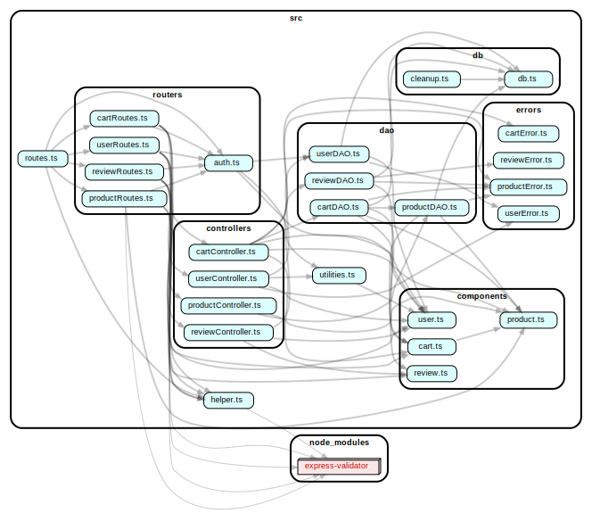
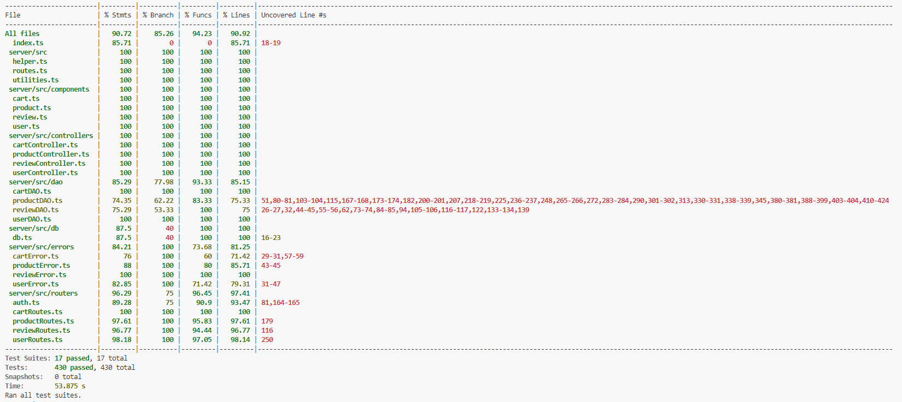

# Test Report

# Contents

- [Test Report](#test-report)
- [Contents](#contents)
- [Dependency graph](#dependency-graph)
- [Integration approach](#integration-approach)
- [Tests](#tests)
- [Coverage](#coverage)
  - [Coverage of FR](#coverage-of-fr)
  - [Coverage white box](#coverage-white-box)

# Dependency graph

    Open this file in an svg editor if you with to better distinguish each connection/arrow

    

# Integration approach

    The original intention regarding the whole testing suite was using a bottom-up approach, so we started with the lowel level unit tests. We continued with testing just the unit tests also for the higher levels too though, routes included, meaning that we mocked the interactions with the lower levels.
    The integration tests have thus been performed only at the route level, meaning that it encompassed the scope of the API tests too.
    The order of implementation was: DAO Unit Tests -> Controller Unit Tests -> Route Unit Tests -> Route Integration/API Tests, that relied on a confident correct operation of the lower level modules.

    Integration (and API) testing focused mainly on the check of FRs and UCs. BB Partitioning (with focus on state and boundaries in some cases) and WB Coverage were not applied here, but were the main methods applied in Unit Testing, where statement and decision coverage Maximization has provided acceptable statistics, while BB partitioning was slightly limited, as the available time didn't allow for an exhaustive implementation.

# Tests

|  ID   | Test case name                                                                                                                                                                     |        Object(s) tested        |   Test level    |            Technique used             |
| :---: | :--------------------------------------------------------------------------------------------------------------------------------------------------------------------------------- | :----------------------------: | :-------------: | :-----------------------------------: |
| C1.1  | Cart - View Current - Success                                                                                                                                                      |  Cart: Route, Controller, DAO  | Integration/API |          FR & UC Compliance           |
| C1.2  | Cart - View Current - Unauthenticated                                                                                                                                              |          Cart: Route           | Integration/API |            BB Partitioning            |
| C1.4  | Cart - View History - Success                                                                                                                                                      |  Cart: Route, Controller, DAO  | Integration/API |          FR & UC Compliance           |
| C1.5  | Cart - View History - Unauthenticated                                                                                                                                              |          Cart: Route           | Integration/API |            BB Partitioning            |
| C1.6  | Cart - Add Product - Success                                                                                                                                                       |  Cart: Route, Controller, DAO  | Integration/API |          FR & UC Compliance           |
| C1.7  | Cart - Add Product - Product Does Not Exist                                                                                                                                        |  Cart: Route, Controller, DAO  | Integration/API |          FR & UC Compliance           |
| C1.8  | Cart - Add Product - Product Not Available                                                                                                                                         |  Cart: Route, Controller, DAO  | Integration/API |          FR & UC Compliance           |
| C1.9  | Cart - Add Product - Unauthenticated                                                                                                                                               |          Cart: Route           | Integration/API |            BB Partitioning            |
| C1.10 | Cart - Pay - Success                                                                                                                                                               |  Cart: Route, Controller, DAO  | Integration/API |          FR & UC Compliance           |
| C1.11 | Cart - Pay - Empty Cart                                                                                                                                                            |  Cart: Route, Controller, DAO  | Integration/API |          FR & UC Compliance           |
| C1.12 | Cart - Pay - No Cart                                                                                                                                                               |  Cart: Route, Controller, DAO  | Integration/API |          FR & UC Compliance           |
| C1.13 | Cart - Pay - Unauthenticated                                                                                                                                                       |          Cart: Route           | Integration/API |            BB Partitioning            |
| C1.14 | Cart - Remove Product - Success                                                                                                                                                    |  Cart: Route, Controller, DAO  | Integration/API |          FR & UC Compliance           |
| C1.15 | Cart - Remove Product - Product Does Not Exist                                                                                                                                     |  Cart: Route, Controller, DAO  | Integration/API |          FR & UC Compliance           |
| C1.16 | Cart - Remove Product - Empty Cart                                                                                                                                                 |  Cart: Route, Controller, DAO  | Integration/API |          FR & UC Compliance           |
| C1.17 | Cart - Remove Product - Product Not In Cart                                                                                                                                        |  Cart: Route, Controller, DAO  | Integration/API |          FR & UC Compliance           |
| C1.18 | Cart - Remove Product - Unauthenticated                                                                                                                                            |          Cart: Route           | Integration/API |            BB Partitioning            |
| C1.19 | Cart - Delete Current - Success                                                                                                                                                    |  Cart: Route, Controller, DAO  | Integration/API |          FR & UC Compliance           |
| C1.20 | Cart - Delete Current - No Cart                                                                                                                                                    |  Cart: Route, Controller, DAO  | Integration/API |          FR & UC Compliance           |
| C1.21 | Cart - Delete Current - Unauthenticated                                                                                                                                            |          Cart: Route           | Integration/API |            BB Partitioning            |
| C1.22 | Cart - View All - Success                                                                                                                                                          |  Cart: Route, Controller, DAO  | Integration/API |          FR & UC Compliance           |
| C1.23 | Cart - View All - Unauthenticated                                                                                                                                                  |          Cart: Route           | Integration/API |            BB Partitioning            |
| C1.24 | Cart - Delete All - Success                                                                                                                                                        |  Cart: Route, Controller, DAO  | Integration/API |          FR & UC Compliance           |
| C1.25 | Cart - Delete All - Unauthenticated                                                                                                                                                |          Cart: Route           | Integration/API |            BB Partitioning            |
| C1.26 | Cart - Remove Product - No Cart                                                                                                                                                    |  Cart: Route, Controller, DAO  | Integration/API |          FR & UC Compliance           |
| C2.1  | Cart.Routes - View Current With Mocks - Success                                                                                                                                    |          Cart: Route           |      Unit       |              WB Coverage              |
| C2.2  | Cart.Routes - View Current With Mocks - Unauthenticated                                                                                                                            |          Cart: Route           |      Unit       |            BB Partitioning            |
| C2.3  | Cart.Routes - View Current With Mocks - Unauthorized: Admin                                                                                                                        |          Cart: Route           |      Unit       |            BB Partitioning            |
| C2.4  | Cart.Routes - View Current With Mocks - Unauthorized: Manager                                                                                                                      |          Cart: Route           |      Unit       |            BB Partitioning            |
| C2.5  | Cart.Routes - View Current With Mocks - DB Failure                                                                                                                                 |          Cart: Route           |      Unit       |        BB Partitioning (state)        |
| C2.6  | Cart.Routes - Add Product With Mocks - Success                                                                                                                                     |          Cart: Route           |      Unit       |              WB Coverage              |
| C2.7  | Cart.Routes - Add Product With Mocks - Unauthenticated                                                                                                                             |          Cart: Route           |      Unit       |            BB Partitioning            |
| C2.8  | Cart.Routes - Add Product With Mocks - Unauthorized: Admin                                                                                                                         |          Cart: Route           |      Unit       |            BB Partitioning            |
| C2.9  | Cart.Routes - Add Product With Mocks - Unauthorized: Manager                                                                                                                       |          Cart: Route           |      Unit       |            BB Partitioning            |
| C2.10 | Cart.Routes - Add Product With Mocks - Zero-Length Model                                                                                                                           |          Cart: Route           |      Unit       |            BB Partitioning            |
| C2.11 | Cart.Routes - Add Product With Mocks - Non-String Model                                                                                                                            |          Cart: Route           |      Unit       |            BB Partitioning            |
| C2.12 | Cart.Routes - Add Product With Mocks - ProductNotFound                                                                                                                             |          Cart: Route           |      Unit       |        BB Partitioning (state)        |
| C2.13 | Cart.Routes - Add Product With Mocks - EmptyProductStock                                                                                                                           |          Cart: Route           |      Unit       |        BB Partitioning (state)        |
| C2.14 | Cart.Routes - Add Product With Mocks - DB Failure                                                                                                                                  |          Cart: Route           |      Unit       |        BB Partitioning (state)        |
| C2.15 | Cart.Routes - Pay With Mocks - Success                                                                                                                                             |          Cart: Route           |      Unit       |              WB Coverage              |
| C2.16 | Cart.Routes - Pay With Mocks - Unauthenticated                                                                                                                                     |          Cart: Route           |      Unit       |            BB Partitioning            |
| C2.17 | Cart.Routes - Pay With Mocks - Unauthorized: Admin                                                                                                                                 |          Cart: Route           |      Unit       |            BB Partitioning            |
| C2.18 | Cart.Routes - Pay With Mocks - Unauthorized: Manager                                                                                                                               |          Cart: Route           |      Unit       |            BB Partitioning            |
| C2.19 | Cart.Routes - Pay With Mocks - NoUnpaidCart                                                                                                                                        |          Cart: Route           |      Unit       |        BB Partitioning (state)        |
| C2.20 | Cart.Routes - Pay With Mocks - EmptyCart                                                                                                                                           |          Cart: Route           |      Unit       |        BB Partitioning (state)        |
| C2.21 | Cart.Routes - Pay With Mocks - EmptyProductStockError                                                                                                                              |          Cart: Route           |      Unit       |        BB Partitioning (state)        |
| C2.22 | Cart.Routes - Pay With Mocks - LowProductStockError                                                                                                                                |          Cart: Route           |      Unit       |        BB Partitioning (state)        |
| C2.23 | Cart.Routes - Pay With Mocks - DB Failure                                                                                                                                          |          Cart: Route           |      Unit       |        BB Partitioning (state)        |
| C2.24 | Cart.Routes - Get History With Mocks - Success                                                                                                                                     |          Cart: Route           |      Unit       |              WB Coverage              |
| C2.25 | Cart.Routes - Get History With Mocks - Unauthenticated                                                                                                                             |          Cart: Route           |      Unit       |            BB Partitioning            |
| C2.26 | Cart.Routes - Get History With Mocks - Unauthorized: Admin                                                                                                                         |          Cart: Route           |      Unit       |            BB Partitioning            |
| C2.27 | Cart.Routes - Get History With Mocks - Unauthorized: Manager                                                                                                                       |          Cart: Route           |      Unit       |            BB Partitioning            |
| C2.28 | Cart.Routes - Get History With Mocks - DB Failure                                                                                                                                  |          Cart: Route           |      Unit       |        BB Partitioning (state)        |
| C2.29 | Cart.Routes - Remove Product With Mocks - Success                                                                                                                                  |          Cart: Route           |      Unit       |              WB Coverage              |
| C2.30 | Cart.Routes - Remove Product With Mocks - Unauthenticated                                                                                                                          |          Cart: Route           |      Unit       |            BB Partitioning            |
| C2.31 | Cart.Routes - Remove Product With Mocks - Unauthorized: Admin                                                                                                                      |          Cart: Route           |      Unit       |            BB Partitioning            |
| C2.32 | Cart.Routes - Remove Product With Mocks - Unauthorized: Manager                                                                                                                    |          Cart: Route           |      Unit       |            BB Partitioning            |
| C2.33 | Cart.Routes - Remove Product With Mocks - ProductNotInCart                                                                                                                         |          Cart: Route           |      Unit       |        BB Partitioning (state)        |
| C2.34 | Cart.Routes - Remove Product With Mocks - No Unpaid Cart                                                                                                                           |          Cart: Route           |      Unit       |        BB Partitioning (state)        |
| C2.35 | Cart.Routes - Remove Product With Mocks - EmptyCartError                                                                                                                           |          Cart: Route           |      Unit       |        BB Partitioning (state)        |
| C2.36 | Cart.Routes - Remove Product With Mocks - ProductNotFoundError                                                                                                                     |          Cart: Route           |      Unit       |        BB Partitioning (state)        |
| C2.37 | Cart.Routes - Remove Product With Mocks - DB Failure                                                                                                                               |          Cart: Route           |      Unit       |        BB Partitioning (state)        |
| C2.38 | Cart.Routes - Delete Current With Mocks - Success                                                                                                                                  |          Cart: Route           |      Unit       |              WB Coverage              |
| C2.39 | Cart.Routes - Delete Current With Mocks - Unauthenticated                                                                                                                          |          Cart: Route           |      Unit       |            BB Partitioning            |
| C2.40 | Cart.Routes - Delete Current With Mocks - Unauthorized: Admin                                                                                                                      |          Cart: Route           |      Unit       |            BB Partitioning            |
| C2.41 | Cart.Routes - Delete Current With Mocks - Unauthorized: Manager                                                                                                                    |          Cart: Route           |      Unit       |            BB Partitioning            |
| C2.42 | Cart.Routes - Delete Current With Mocks - No Unpaid Cart                                                                                                                           |          Cart: Route           |      Unit       |        BB Partitioning (state)        |
| C2.43 | Cart.Routes - Delete Current With Mocks - DB Failure                                                                                                                               |          Cart: Route           |      Unit       |        BB Partitioning (state)        |
| C2.44 | Cart.Routes - Delete All With Mocks - Success Admin                                                                                                                                |          Cart: Route           |      Unit       |     WB Coverage & BB Partitioning     |
| C2.45 | Cart.Routes - Delete All With Mocks - Success Manager                                                                                                                              |          Cart: Route           |      Unit       |     WB Coverage & BB Partitioning     |
| C2.46 | Cart.Routes - Delete All With Mocks - Unauthenticated                                                                                                                              |          Cart: Route           |      Unit       |            BB Partitioning            |
| C2.47 | Cart.Routes - Delete All With Mocks - Unauthorized: Customer                                                                                                                       |          Cart: Route           |      Unit       |            BB Partitioning            |
| C2.48 | Cart.Routes - Delete All With Mocks - DB Failure                                                                                                                                   |          Cart: Route           |      Unit       |        BB Partitioning (state)        |
| C2.49 | Cart.Routes - Get All With Mocks - Success Admin                                                                                                                                   |          Cart: Route           |      Unit       |     WB Coverage & BB Partitioning     |
| C2.50 | Cart.Routes - Get All With Mocks - Success Manager                                                                                                                                 |          Cart: Route           |      Unit       |     WB Coverage & BB Partitioning     |
| C2.51 | Cart.Routes - Get All With Mocks - Unauthenticated                                                                                                                                 |          Cart: Route           |      Unit       |            BB Partitioning            |
| C2.52 | Cart.Routes - Get All With Mocks - Unauthorized: Customer                                                                                                                          |          Cart: Route           |      Unit       |            BB Partitioning            |
| C2.53 | Cart.Routes - Get All With Mocks - DB Failure                                                                                                                                      |          Cart: Route           |      Unit       |        BB Partitioning (state)        |
| C3.1  | Cart.Controller - addToCart With Mocks - Success: Existing Cart                                                                                                                    |        Cart: Controller        |      Unit       | WB Coverage & BB Partitioning (state) |
| C3.2  | Cart.Controller - addToCart With Mocks - Success: New Cart                                                                                                                         |        Cart: Controller        |      Unit       | WB Coverage & BB Partitioning (state) |
| C3.3  | Cart.Controller - addToCart With Mocks - ProductNotFoundError                                                                                                                      |        Cart: Controller        |      Unit       |              WB Coverage              |
| C3.4  | Cart.Controller - addToCart With Mocks - EmptyProductStockError                                                                                                                    |        Cart: Controller        |      Unit       |              WB Coverage              |
| C3.5  | Cart.Controller - getCart With Mocks - Success: Existing Cart                                                                                                                      |        Cart: Controller        |      Unit       | WB Coverage & BB Partitioning (state) |
| C3.6  | Cart.Controller - getCart With Mocks - Success: New Cart                                                                                                                           |        Cart: Controller        |      Unit       | WB Coverage & BB Partitioning (state) |
| C3.7  | Cart.Controller - getCart With Mocks - Success: Empty Cart                                                                                                                         |        Cart: Controller        |      Unit       |              WB Coverage              |
| C3.8  | Cart.Controller - getCart With Mocks - DB Failure                                                                                                                                  |        Cart: Controller        |      Unit       |        BB Partitioning (state)        |
| C3.9  | Cart.Controller - checkoutCart With Mocks - Success                                                                                                                                |        Cart: Controller        |      Unit       |              WB Coverage & WB Coverage & Loop (N) Coverage             |
| C3.10 | Cart.Controller - checkoutCart With Mocks - CartNotFoundError                                                                                                                      |        Cart: Controller        |      Unit       |              WB Coverage              |
| C3.11 | Cart.Controller - checkoutCart With Mocks - EmptyCartError                                                                                                                         |        Cart: Controller        |      Unit       |              WB Coverage              |
| C3.12 | Cart.Controller - checkoutCart With Mocks - EmptyProductStockError                                                                                                                 |        Cart: Controller        |      Unit       |              WB Coverage & Loop (1) Coverage              |
| C3.13 | Cart.Controller - checkoutCart With Mocks - LowProductStockError                                                                                                                   |        Cart: Controller        |      Unit       |              WB Coverage              |
| C3.14 | Cart.Controller - checkoutCart With Mocks - DB Failure                                                                                                                             |        Cart: Controller        |      Unit       |        BB Partitioning (state)        |
| C3.15 | Cart.Controller - getCustomerCarts With Mocks - Success: Carts Exist                                                                                                               |        Cart: Controller        |      Unit       | WB Coverage & BB Partitioning (state) |
| C3.16 | Cart.Controller - getCustomerCarts With Mocks - Success: No Carts                                                                                                                  |        Cart: Controller        |      Unit       | WB Coverage & BB Partitioning (state) |
| C3.17 | Cart.Controller - getCustomerCarts With Mocks - DB Failure                                                                                                                         |        Cart: Controller        |      Unit       |        BB Partitioning (state)        |
| C3.18 | Cart.Controller - removeProductFromCart With Mocks - Success: Some Quantity Left                                                                                                   |        Cart: Controller        |      Unit       | WB Coverage & BB Partitioning (state) |
| C3.19 | Cart.Controller - removeProductFromCart With Mocks - Success: No Quantity Left                                                                                                     |        Cart: Controller        |      Unit       | WB Coverage & BB Partitioning (state) |
| C3.20 | Cart.Controller - removeProductFromCart With Mocks - CartNotFoundError                                                                                                             |        Cart: Controller        |      Unit       |              WB Coverage              |
| C3.21 | Cart.Controller - removeProductFromCart With Mocks - EmptyCartError                                                                                                                |        Cart: Controller        |      Unit       |              WB Coverage              |
| C3.22 | Cart.Controller - removeProductFromCart With Mocks - ProductNotFoundError                                                                                                          |        Cart: Controller        |      Unit       |              WB Coverage              |
| C3.23 | Cart.Controller - removeProductFromCart With Mocks - ProductNotInCartError                                                                                                         |        Cart: Controller        |      Unit       |              WB Coverage              |
| C3.24 | Cart.Controller - removeProductFromCart With Mocks - DB Failure                                                                                                                    |        Cart: Controller        |      Unit       |        BB Partitioning (state)        |
| C3.25 | Cart.Controller - clearCart With Mocks - Success                                                                                                                                   |        Cart: Controller        |      Unit       |              WB Coverage              |
| C3.26 | Cart.Controller - clearCart With Mocks - CartNotFoundError                                                                                                                         |        Cart: Controller        |      Unit       |              WB Coverage              |
| C3.27 | Cart.Controller - clearCart With Mocks - DB Failure                                                                                                                                |        Cart: Controller        |      Unit       |        BB Partitioning (state)        |
| C3.28 | Cart.Controller - deleteAllCarts With Mocks - Success                                                                                                                              |        Cart: Controller        |      Unit       |              WB Coverage              |
| C3.29 | Cart.Controller - deleteAllCarts With Mocks - DB Failure                                                                                                                           |        Cart: Controller        |      Unit       |        BB Partitioning (state)        |
| C3.30 | Cart.Controller - getAllCarts With Mocks - Success: Carts Exist                                                                                                                    |        Cart: Controller        |      Unit       | WB Coverage & BB Partitioning (state) |
| C3.31 | Cart.Controller - getAllCarts With Mocks - Success: No Carts                                                                                                                       |        Cart: Controller        |      Unit       | WB Coverage & BB Partitioning (state) |
| C3.32 | Cart.Controller - getAllCarts With Mocks - DB Failure                                                                                                                              |        Cart: Controller        |      Unit       |        BB Partitioning (state)        |
| C4.1  | Cart.DAO - createCart With Mocks - Success                                                                                                                                         |           Cart: DAO            |      Unit       |              WB Coverage              |
| C4.2  | Cart.DAO - createCart With Mocks - Zero-Lenght Username                                                                                                                            |           Cart: DAO            |      Unit       |            BB Partitioning            |
| C4.3  | Cart.DAO - createCart With Mocks - Cart Already Exists                                                                                                                             |           Cart: DAO            |      Unit       |        BB Partitioning (state)        |
| C4.4  | Cart.DAO - createCart With Mocks - DB Failure: db.get                                                                                                                              |           Cart: DAO            |      Unit       |              WB Coverage              |
| C4.5  | Cart.DAO - createCart With Mocks - DB Failure: db.run                                                                                                                              |           Cart: DAO            |      Unit       |              WB Coverage              |
| C4.6  | Cart.DAO - getUnpaidCart With Mocks - Success: Empty Cart                                                                                                                          |           Cart: DAO            |      Unit       | WB Coverage & BB Partitioning (state) |
| C4.7  | Cart.DAO - getUnpaidCart With Mocks - Success: Filled Cart                                                                                                                         |           Cart: DAO            |      Unit       | WB Coverage & BB Partitioning (state) |
| C4.8  | Cart.DAO - getUnpaidCart With Mocks - Success: No Cart                                                                                                                             |           Cart: DAO            |      Unit       | WB Coverage & BB Partitioning (state) |
| C4.9  | Cart.DAO - getUnpaidCart With Mocks - Zero-Lenght Username                                                                                                                         |           Cart: DAO            |      Unit       |            BB Partitioning            |
| C4.10 | Cart.DAO - getUnpaidCart With Mocks - Multiple Unpaid Carts                                                                                                                        |           Cart: DAO            |      Unit       |        BB Partitioning (state)        |
| C4.11 | Cart.DAO - getUnpaidCart With Mocks - Invalid ProductsInCartList JSON                                                                                                              |           Cart: DAO            |      Unit       |        BB Partitioning (state)        |
| C4.12 | Cart.DAO - getUnpaidCart With Mocks - DB Failure: db.all                                                                                                                           |           Cart: DAO            |      Unit       |              WB Coverage              |
| C4.13 | Cart.DAO - updateCurrentCartContentAndTotal With Mocks - Success: Empty Cart                                                                                                       |           Cart: DAO            |      Unit       | WB Coverage & BB Partitioning (state) |
| C4.14 | Cart.DAO - updateCurrentCartContentAndTotal With Mocks - Success: Filled Cart                                                                                                      |           Cart: DAO            |      Unit       | WB Coverage & BB Partitioning (state) |
| C4.15 | Cart.DAO - updateCurrentCartContentAndTotal With Mocks - DB Failure: db.run                                                                                                        |           Cart: DAO            |      Unit       |              WB Coverage              |
| C4.16 | Cart.DAO - updateCurrentCartContentAndTotal With Mocks - Cart Already Paid                                                                                                         |           Cart: DAO            |      Unit       |        BB Partitioning (state)        |
| C4.17 | Cart.DAO - updateCurrentCartContentAndTotal With Mocks - Zero-Lenght Username                                                                                                      |           Cart: DAO            |      Unit       |            BB Partitioning            |
| C4.18 | Cart.DAO - updateCurrentCartContentAndTotal With Mocks - Negative Total                                                                                                            |           Cart: DAO            |      Unit       |            BB Partitioning            |
| C4.19 | Cart.DAO - updateCurrentCartContentAndTotal With Mocks - No Unpaid Cart                                                                                                            |           Cart: DAO            |      Unit       |        BB Partitioning (state)        |
| C4.20 | Cart.DAO - updateCurrentCartContentAndTotal With Mocks - Multiple Unpaid Carts                                                                                                     |           Cart: DAO            |      Unit       |        BB Partitioning (state)        |
| C4.21 | Cart.DAO - updateCurrentCartContentAndTotal With Mocks - DB Failure: db.all                                                                                                        |           Cart: DAO            |      Unit       |              WB Coverage              |
| C4.22 | Cart.DAO - payCurrentCart With Mocks - Success                                                                                                                                     |           Cart: DAO            |      Unit       | WB Coverage & BB Partitioning (state) |
| C4.23 | Cart.DAO - payCurrentCart With Mocks - DB Failure: db.run                                                                                                                          |           Cart: DAO            |      Unit       |              WB Coverage              |
| C4.24 | Cart.DAO - payCurrentCart With Mocks - Zero-Lenght Username                                                                                                                        |           Cart: DAO            |      Unit       |            BB Partitioning            |
| C4.25 | Cart.DAO - getPaidCarts With Mocks - Success: Non-Empty List                                                                                                                       |           Cart: DAO            |      Unit       | WB Coverage & BB Partitioning (state) |
| C4.26 | Cart.DAO - getPaidCarts With Mocks - Success: Empty List                                                                                                                           |           Cart: DAO            |      Unit       | WB Coverage & BB Partitioning (state) |
| C4.27 | Cart.DAO - getPaidCarts With Mocks - Zero-Lenght Username                                                                                                                          |           Cart: DAO            |      Unit       |            BB Partitioning            |
| C4.28 | Cart.DAO - getPaidCarts With Mocks - DB Failure: db.all                                                                                                                            |           Cart: DAO            |      Unit       |              WB Coverage              |
| C4.29 | Cart.DAO - getAllCarts With Mocks - Success: Carts Exist                                                                                                                           |           Cart: DAO            |      Unit       | WB Coverage & BB Partitioning (state) |
| C4.30 | Cart.DAO - getAllCarts With Mocks - Success: No Carts                                                                                                                              |           Cart: DAO            |      Unit       | WB Coverage & BB Partitioning (state) |
| C4.31 | Cart.DAO - getAllCarts With Mocks - DB Failure: db.all                                                                                                                             |           Cart: DAO            |      Unit       |              WB Coverage              |
| C4.32 | Cart.DAO - deleteAllCarts With Mocks - Success                                                                                                                                     |           Cart: DAO            |      Unit       | WB Coverage & BB Partitioning (state) |
| C4.33 | Cart.DAO - deleteAllCarts With Mocks - DB Failure: db.run                                                                                                                          |           Cart: DAO            |      Unit       |              WB Coverage              |
| C4.34 | Cart.DAO - updateQuantity With Mocks - Success                                                                                                                                     |           Cart: DAO            |      Unit       | WB Coverage & BB Partitioning (state) |
| C4.35 | Cart.DAO - updateQuantity With Mocks - Zero-Lenght Model                                                                                                                           |           Cart: DAO            |      Unit       |            BB Partitioning            |
| C4.36 | Cart.DAO - updateQuantity With Mocks - Negative Quantity                                                                                                                           |           Cart: DAO            |      Unit       |            BB Partitioning            |
| C4.37 | Cart.DAO - updateQuantity With Mocks - DB Failure: db.run                                                                                                                          |           Cart: DAO            |      Unit       |              WB Coverage              |
| C4.38 | Cart.DAO - getProductByModel With Mocks - Success: Existing Product                                                                                                                |           Cart: DAO            |      Unit       | WB Coverage & BB Partitioning (state) |
| C4.39 | Cart.DAO - getProductByModel With Mocks - Success: Not Existing Product                                                                                                            |           Cart: DAO            |      Unit       | WB Coverage & BB Partitioning (state) |
| C4.40 | Cart.DAO - getProductByModel With Mocks - Zero-Lenght Model                                                                                                                        |           Cart: DAO            |      Unit       |            BB Partitioning            |
| C4.41 | Cart.DAO - getProductByModel With Mocks - DB Failure: db.get                                                                                                                       |           Cart: DAO            |      Unit       |              WB Coverage              |
| C4.42 | Cart.DAO - getProductByModel With Mocks - Invalid Product Category                                                                                                                 |           Cart: DAO            |      Unit       |            BB Partitioning            |
| C4.43 | Cart.DAO - getProductByModel With Mocks - Typo In Product Category (non uppercase first letter)                                                                                    |           Cart: DAO            |      Unit       |              BB Boundary              |
| C4.44 | Cart.DAO - getProductByModel With Mocks - Typo In Product Category (generic typo)                                                                                                  |           Cart: DAO            |      Unit       |              BB Boundary              |
| P1.1  | Product - Register a set of new products - Scenario 6.1 - Register a new product                                                                                                   |            Product             | Integration/API |          FR & UC Compliance           |
| P1.2  | Product - Register a set of new products - Scenario 6.2 - Try to register a product that already exists                                                                            |            Product             | Integration/API |              BB Boundary              |
| P1.3  | Product - Register a set of new products - Scenario 6.3 - Try to register a product with invalid input parameters                                                                  |            Product             | Integration/API |              BB Boundary              |
| P1.4  | Product - Update the quantity of a product - Scenario 6.4 - Update the quantity of a product                                                                                       |            Product             | Integration/API |          FR & UC Compliance           |
| P1.5  | Product - Update the quantity of a product - Scenario 6.5 - Try to increase the quantity of a product that does not exist                                                          |            Product             | Integration/API |              BB Boundary              |
| P1.6  | Product - Sell a product - Scenario 7.1 - Sell a product after an in-store purchase                                                                                                |            Product             | Integration/API |          FR & UC Compliance           |
| P1.7  | Product - Sell a product - Scenario 7.2 - Try to sell a product that does not exist                                                                                                |            Product             | Integration/API |              BB Boundary              |
| P1.8  | Product - Sell a product - Scenario 7.3 - Try to sell an unavailable product                                                                                                       |            Product             | Integration/API |              BB Boundary              |
| P1.9  | Product - Show the list of all products - Scenario 8.1 - View information of a single product                                                                                      |            Product             | Integration/API |          FR & UC Compliance           |
| P1.10 | Product - Show the list of all products - Scenario 8.3 - View information of all products                                                                                          |            Product             | Integration/API |          FR & UC Compliance           |
| P1.11 | Product - Show the list of available products - Scenario 8.7 - View information of all available products                                                                          |            Product             | Integration/API |          FR & UC Compliance           |
| P1.12 | Product - Show the list of all products with the same category - Scenario 8.4 - View information of all products of the same category                                              |            Product             | Integration/API |          FR & UC Compliance           |
| P1.13 | Product - Show the list of all available products with the same category - Scenario 8.8 - View information of all available products of the same category                          |            Product             | Integration/API |              BB Boundary              |
| P1.14 | Product - Show the list of all available products with the same category - Scenario 8.5 - Try to view information of all products of a category that does not exist                |            Product             | Integration/API |              BB Boundary              |
| P1.15 | Product - Show the list of all products with the same model - Scenario 8.2 - Try to view information of a product that does not exist                                              |            Product             | Integration/API |              BB Boundary              |
| P1.16 | Product - Show the list of all products with the same model - Scenario 8.6 - View information of all products with the same model                                                  |            Product             | Integration/API |              BB Boundary              |
| P1.17 | Product - Show the list of all available products with the same model - Scenario 8.9 - View information of all available products with the same model                              |            Product             | Integration/API |              BB Boundary              |
| P1.18 | Product - Delete a product - Scenario 9.1 - Delete one product                                                                                                                     |            Product             | Integration/API |          FR & UC Compliance           |
| P1.19 | Product - Delete a product - Scenario 9.2 - Try to delete a product that does not exist                                                                                            |            Product             | Integration/API |              BB Boundary              |
| P1.20 | Product - Delete all products - Scenario 14.1 - Delete all products                                                                                                                |            Product             | Integration/API |          FR & UC Compliance           |
| P2.1  | Product.Routes - POST - Route to register the arrival of a set of products                                                                                                         |         Product: Route         |      Unit       |              WB Coverage              |
| P2.2  | Product.Routes - POST - Return a 401 error when user is not logged in                                                                                                              |         Product: Route         |      Unit       |            BB Partitioning            |
| P2.3  | Product.Routes - POST - Return a 401 error when user is not an admin or manager                                                                                                    |         Product: Route         |      Unit       |            BB Partitioning            |
| P2.4  | Product.Routes - POST - Return a 409 error when product already exists                                                                                                             |         Product: Route         |      Unit       |            BB Partitioning            |
| P2.5  | Product.Routes - POST - Return a 400 error when arrival date is after current date                                                                                                 |         Product: Route         |      Unit       |            BB Partitioning            |
| P2.6  | Product.Routes - PATCH - Route to update the stock of a product /ezelectronics/products/:model - Route to update product stock                                                     |         Product: Route         |      Unit       |              WB Coverage              |
| P2.7  | Product.Routes - PATCH - Route to update the stock of a product /ezelectronics/products/:model - Return a 401 error when user is not logged in                                     |         Product: Route         |      Unit       |            BB Partitioning            |
| P2.8  | Product.Routes - PATCH - Route to update the stock of a product /ezelectronics/products/:model - Return a 401 error when user is not an admin or manager                           |         Product: Route         |      Unit       |            BB Partitioning            |
| P2.9  | Product.Routes - PATCH - Route to update the stock of a product /ezelectronics/products/:model - Return a 404 Product Not Found                                                    |         Product: Route         |      Unit       |            BB Partitioning            |
| P2.10 | Product.Routes - PATCH - Route to update the stock of a product /ezelectronics/products/:model - Return a 400 error when change date is after current date                         |         Product: Route         |      Unit       |            BB Partitioning            |
| P2.11 | Product.Routes - PATCH - Route to update the stock of a product /ezelectronics/products/:model - Return a 400 error when change date is before product's arrival date              |         Product: Route         |      Unit       |            BB Partitioning            |
| P2.12 | Product.Routes - PATCH - Route to sell a product /ezelectronics/products/:model/sell - Route for selling a product                                                                 |         Product: Route         |      Unit       |              WB Coverage              |
| P2.13 | Product.Routes - PATCH - Route to sell a product /ezelectronics/products/:model/sell - Return a 401 error when user is not logged in                                               |         Product: Route         |      Unit       |            BB Partitioning            |
| P2.14 | Product.Routes - PATCH - Route to sell a product /ezelectronics/products/:model/sell - Return a 401 error when user is not an admin or manager                                     |         Product: Route         |      Unit       |            BB Partitioning            |
| P2.15 | Product.Routes - PATCH - Route to sell a product /ezelectronics/products/:model/sell - Return a 404 Product Not Found                                                              |         Product: Route         |      Unit       |            BB Partitioning            |
| P2.16 | Product.Routes - PATCH - Route to sell a product /ezelectronics/products/:model/sell - Return a 400 error when selling date is after current dat                                   |         Product: Route         |      Unit       |            BB Partitioning            |
| P2.17 | Product.Routes - PATCH - Route to sell a product /ezelectronics/products/:model/sell - Return a 400 error when selling date is before product's arrival date                       |         Product: Route         |      Unit       |            BB Partitioning            |
| P2.18 | Product.Routes - PATCH - Route to sell a product /ezelectronics/products/:model/sell - Return a 409 error when product is out of stock                                             |         Product: Route         |      Unit       |            BB Partitioning            |
| P2.19 | Product.Routes - PATCH - Route to sell a product /ezelectronics/products/:model/sell - Return a 409 error when available quantity is lower than requested                          |         Product: Route         |      Unit       |            BB Partitioning            |
| P2.20 | Product.Routes - GET - Route to get all products /ezelectronics/products - Route to get all products                                                                               |         Product: Route         |      Unit       |              WB Coverage              |
| P2.21 | Product.Routes - GET - Route to get all products /ezelectronics/products - Route to get all Laptop products                                                                        |         Product: Route         |      Unit       |              WB Coverage              |
| P2.22 | Product.Routes - GET - Route to get all products /ezelectronics/products - Route to get Test products                                                                              |         Product: Route         |      Unit       |              WB Coverage              |
| P2.23 | Product.Routes - GET - Route to get all products /ezelectronics/products - Return a 401 error when user is not logged in                                                           |         Product: Route         |      Unit       |            BB Partitioning            |
| P2.24 | Product.Routes - GET - Route to get all products /ezelectronics/products - Return a 401 error when user is not an admin or manager                                                 |         Product: Route         |      Unit       |            BB Partitioning            |
| P2.25 | Product.Routes - GET - Route to get all products /ezelectronics/products - Return a 422 error when grouping is null but category or model is not                                   |         Product: Route         |      Unit       |            BB Partitioning            |
| P2.26 | Product.Routes - GET - Route to get all products /ezelectronics/products - Return a 422 error when grouping is category, category is null or model is not null                     |         Product: Route         |      Unit       |            BB Partitioning            |
| P2.27 | Product.Routes - GET - Route to get all products /ezelectronics/products - Return a 422 error when grouping is model, category is not null or model is null                        |         Product: Route         |      Unit       |            BB Partitioning            |
| P2.28 | Product.Routes - GET - Route to get all products /ezelectronics/products - Return a 404 error when no products were found                                                          |         Product: Route         |      Unit       |            BB Partitioning            |
| P2.29 | Product.Routes - GET - Route to get all available products /ezelectronics/products/available - Route to get all available products                                                 |         Product: Route         |      Unit       |              WB Coverage              |
| P2.30 | Product.Routes - GET - Route to get all available products /ezelectronics/products/available - Route to get all available Laptop products                                          |         Product: Route         |      Unit       |              WB Coverage              |
| P2.31 | Product.Routes - GET - Route to get all available products /ezelectronics/products/available - Route to get available Test products                                                |         Product: Route         |      Unit       |              WB Coverage              |
| P2.32 | Product.Routes - GET - Route to get all available products /ezelectronics/products/available - Return a 401 error when user is not logged in                                       |         Product: Route         |      Unit       |            BB Partitioning            |
| P2.33 | Product.Routes - GET - Route to get all available products /ezelectronics/products/available - Return a 422 error when grouping is null but category or model is not               |         Product: Route         |      Unit       |            BB Partitioning            |
| P2.34 | Product.Routes - GET - Route to get all available products /ezelectronics/products/available - Return a 422 error when grouping is category, category is null or model is not null |         Product: Route         |      Unit       |            BB Partitioning            |
| P2.35 | Product.Routes - GET - Route to get all available products /ezelectronics/products/available - Return a 422 error when grouping is model, category is not null or model is null    |         Product: Route         |      Unit       |            BB Partitioning            |
| P2.36 | Product.Routes - GET - Route to get all available products /ezelectronics/products/available - Return a 404 error when no products were found                                      |         Product: Route         |      Unit       |            BB Partitioning            |
| P2.37 | Product.Routes - DELETE - Route to delete a product /ezelectronics/products/:model - Route to delete an specific product                                                           |         Product: Route         |      Unit       |              WB Coverage              |
| P2.38 | Product.Routes - DELETE - Route to delete a product /ezelectronics/products/:model - Return a 401 error when user is not logged in                                                 |         Product: Route         |      Unit       |            BB Partitioning            |
| P2.39 | Product.Routes - DELETE - Route to delete a product /ezelectronics/products/:model - Return a 401 error when user is not an admin or manager                                       |         Product: Route         |      Unit       |            BB Partitioning            |
| P2.40 | Product.Routes - DELETE - Route to delete a product /ezelectronics/products/:model - Return a 404 Product Not Found                                                                |         Product: Route         |      Unit       |            BB Partitioning            |
| P2.41 | Product.Routes - DELETE - Route to delete all products /ezelectronics/products - When the user is an admin                                                                         |         Product: Route         |      Unit       |            BB Partitioning            |
| P2.42 | Product.Routes - DELETE - Route to delete all products /ezelectronics/products - Return a 401 error when user is not logged in                                                     |         Product: Route         |      Unit       |            BB Partitioning            |
| P2.43 | Product.Routes - DELETE - Route to delete all products /ezelectronics/products - Return a 401 error when user is not an admin or manager                                           |         Product: Route         |      Unit       |            BB Partitioning            |
| P3.1  | Product.Controller - Register Products - Create a new product and return void                                                                                                      |         Product: Route         |      Unit       |              WB Coverage              |
| P3.2  | Product.Controller - Register Products - Return a ModelAlreadyExistsError when product already exist                                                                               |         Product: Route         |      Unit       |            BB Partitioning            |
| P3.3  | Product.Controller - Register Products - Return an error when arrival date is after the current date                                                                               |         Product: Route         |      Unit       |            BB Partitioning            |
| P3.4  | Product.Controller - Change Product Quantity - Increase the quantity of a product and return the new quantity                                                                      |         Product: Route         |      Unit       |              WB Coverage              |
| P3.5  | Product.Controller - Change Product Quantity - Return a ProductNotFoundError when model does not exist                                                                             |         Product: Route         |      Unit       |            BB Partitioning            |
| P3.6  | Product.Controller - Change Product Quantity - Return an error when arrival date is after the current date                                                                         |         Product: Route         |      Unit       |            BB Partitioning            |
| P3.7  | Product.Controller - Change Product Quantity - Return an error when arrival date is before arrival date                                                                            |         Product: Route         |      Unit       |            BB Partitioning            |
| P3.8  | Product.Controller - Sell Product - Decrease the quantity of a product and return the new quantity                                                                                 |         Product: Route         |      Unit       |              WB Coverage              |
| P3.9  | Product.Controller - Sell Product - Return a ProductNotFoundError when model does not exist                                                                                        |         Product: Route         |      Unit       |            BB Partitioning            |
| P3.10 | Product.Controller - Sell Product - Return an error when selling date is after the current date                                                                                    |         Product: Route         |      Unit       |            BB Partitioning            |
| P3.11 | Product.Controller - Sell Product - Return an error when selling date is before arrival date                                                                                       |         Product: Route         |      Unit       |            BB Partitioning            |
| P3.12 | Product.Controller - Sell Product - Return an EmptyProductStockError when product stock is empty                                                                                   |         Product: Route         |      Unit       |            BB Partitioning            |
| P3.13 | Product.Controller - Sell Product - Return all products when no grouping is provided                                                                                               |         Product: Route         |      Unit       |            BB Partitioning            |
| P3.14 | Product.Controller - Get Products - Return all products filtered by category                                                                                                       |         Product: Route         |      Unit       |              WB Coverage              |
| P3.15 | Product.Controller - Get Products - Return all products filtered by model                                                                                                          |         Product: Route         |      Unit       |            BB Partitioning            |
| P3.16 | Product.Controller - Get Products - Return an error when grouping is not present and model or category are present                                                                 |         Product: Route         |      Unit       |            BB Partitioning            |
| P3.17 | Product.Controller - Get Products - Return an error when grouping is category and model is present or category is null                                                             |         Product: Route         |      Unit       |            BB Partitioning            |
| P3.18 | Product.Controller - Get Products - Return an error when grouping is model and model is null or category is present                                                                |         Product: Route         |      Unit       |            BB Partitioning            |
| P3.19 | Product.Controller - Get Products - Return a ProductNotFoundError when model does not exist                                                                                        |         Product: Route         |      Unit       |            BB Partitioning            |
| P3.20 | Product.Controller - Get Available Products - Return all available products when no grouping is provided                                                                           |         Product: Route         |      Unit       |              WB Coverage              |
| P3.21 | Product.Controller - Get Available Products - Return all available products filtered by category                                                                                   |         Product: Route         |      Unit       |            BB Partitioning            |
| P3.22 | Product.Controller - Get Available Products - Return all available products filtered by model                                                                                      |         Product: Route         |      Unit       |            BB Partitioning            |
| P3.23 | Product.Controller - Get Available Products - Return an error when grouping is not present and model or category are present                                                       |         Product: Route         |      Unit       |            BB Partitioning            |
| P3.24 | Product.Controller - Get Available Products - Return an error when grouping is category and model is present or category is null                                                   |         Product: Route         |      Unit       |            BB Partitioning            |
| P3.25 | Product.Controller - Get Available Products - Return an error when grouping is model and model is null or category is present                                                      |         Product: Route         |      Unit       |            BB Partitioning            |
| P3.26 | Product.Controller - Get Available Products - Return a ProductNotFoundError when model does not exist                                                                              |         Product: Route         |      Unit       |            BB Partitioning            |
| P3.27 | Product.Controller - Delete Product - Delete a product and return true                                                                                                             |         Product: Route         |      Unit       |              WB Coverage              |
| P3.28 | Product.Controller - Delete Product - Return a ProductNotFoundError when model does not exist"                                                                                     |         Product: Route         |      Unit       |            BB Partitioning            |
| P3.29 | Product.Controller - Delete All Products - Delete all products and return true                                                                                                     |         Product: Route         |      Unit       |            BB Partitioning            |
| P4.1  | Product.DAO - Register Products - Create a product - without date                                                                                                                  |          Product: DAO          |      Unit       |              WB Coverage              |
| P4.2  | Product.DAO - Register Products - Create a product - with date                                                                                                                     |          Product: DAO          |      Unit       |              WB Coverage              |
| P4.3  | Product.DAO - Register Products - Return an error when the arrival date is after current date                                                                                      |          Product: DAO          |      Unit       |            BB Partitioning            |
| P4.4  | Product.DAO - Register Products - Return error ModelAlreadyExistsError when product already exists                                                                                 |          Product: DAO          |      Unit       |            BB Partitioning            |
| P4.5  | Product.DAO - Change Product Quantity - Change the quantity of a product - without date                                                                                            |          Product: DAO          |      Unit       |              WB Coverage              |
| P4.6  | Product.DAO - Change Product Quantity - Change the quantity of a product - with date                                                                                               |          Product: DAO          |      Unit       |              WB Coverage              |
| P4.7  | Product.DAO - Change Product Quantity - Return ProductNotFoundError when product not found - without date                                                                          |          Product: DAO          |      Unit       |            BB Partitioning            |
| P4.8  | Product.DAO - Change Product Quantity - Return ProductNotFoundError when product not found - with date                                                                             |          Product: DAO          |      Unit       |            BB Partitioning            |
| P4.9  | Product.DAO - Change Product Quantity - Return an error when the arrival date is after current date                                                                                |          Product: DAO          |      Unit       |            BB Partitioning            |
| P4.10 | Product.DAO - Change Product Quantity - Return an error when the arrival date is before previous arrival date                                                                      |          Product: DAO          |      Unit       |            BB Partitioning            |
| P4.11 | Product.DAO - Sell Product - Sell a product - without date                                                                                                                         |          Product: DAO          |      Unit       |              WB Coverage              |
| P4.12 | Product.DAO - Sell Product - Sell a product - with date                                                                                                                            |          Product: DAO          |      Unit       |              WB Coverage              |
| P4.13 | Product.DAO - Sell Product - Return ProductNotFoundError when product not found                                                                                                    |          Product: DAO          |      Unit       |            BB Partitioning            |
| P4.14 | Product.DAO - Sell Product - Return an error when the arrival date is after current date                                                                                           |          Product: DAO          |      Unit       |            BB Partitioning            |
| P4.15 | Product.DAO - Sell Product - Return an error when the arrival date is before previous arrival date                                                                                 |          Product: DAO          |      Unit       |            BB Partitioning            |
| P4.16 | Product.DAO - Sell Product - Return EmptyProductStockError when product is out of stock                                                                                            |          Product: DAO          |      Unit       |              BB Boundary              |
| P4.17 | Product.DAO - Sell Product - Return LowProductStockError when product stock is below requested quantity                                                                            |          Product: DAO          |      Unit       |            BB Partitioning            |
| P4.18 | Product.DAO - Get Products - Return all products                                                                                                                                   |          Product: DAO          |      Unit       |              WB Coverage              |
| P4.19 | Product.DAO - Get Products - Return null when products not found                                                                                                                   |          Product: DAO          |      Unit       |              BB Boundary              |
| P4.20 | Product.DAO - Get Products By Category - Return a product with specific category                                                                                                   |          Product: DAO          |      Unit       |              WB Coverage              |
| P4.21 | Product.DAO - Get Products By Category - Return null when products not found                                                                                                       |          Product: DAO          |      Unit       |              BB Boundary              |
| P4.22 | Product.DAO - Get Products By Model - Return a product with specific model                                                                                                         |          Product: DAO          |      Unit       |              WB Coverage              |
| P4.23 | Product.DAO - Get Products By Model - Return ProductNotFoundError when model not found                                                                                             |          Product: DAO          |      Unit       |              BB Boundary              |
| P4.24 | Product.DAO - Get Available Products - Return all products with quantity above 0                                                                                                   |          Product: DAO          |      Unit       |              WB Coverage              |
| P4.25 | Product.DAO - Get Available Products - Return null when no available products where found                                                                                          |          Product: DAO          |      Unit       |            BB Partitioning            |
| P4.26 | Product.DAO - Get Available Products By Category - Return a product with quantity above 0 of a specific category                                                                   |          Product: DAO          |      Unit       |              WB Coverage              |
| P4.27 | Product.DAO - Get Available Products By Category - Return null when no available products where found                                                                              |          Product: DAO          |      Unit       |            BB Partitioning            |
| P4.28 | Product.DAO - Get Available Products By Model - Return a product with quantity above 0 of a specific model                                                                         |          Product: DAO          |      Unit       |              WB Coverage              |
| P4.29 | Product.DAO - Get Available Products By Model - Return ProductNotFoundError when model not found                                                                                   |          Product: DAO          |      Unit       |            BB Partitioning            |
| P4.30 | Product.DAO - Delete All Products - Delete all products                                                                                                                            |          Product: DAO          |      Unit       |              WB Coverage              |
| P4.31 | Product.DAO - Delete Products - Delete a specific product                                                                                                                          |          Product: DAO          |      Unit       |            BB Partitioning            |
| P4.32 | Product.DAO - Delete Products - Return ProductNotFoundError when product not found                                                                                                 |          Product: DAO          |      Unit       |            BB Partitioning            |
| U1.1  | User - Login FR1.1 S1.1                                                                                                                                                            |  User: Route, Controller, DAO  | Integration/API |          FR & UC Compliance           |
| U1.2  | User - Login Wrong PSW FR1.1 S1.2                                                                                                                                                  |  User: Route, Controller, DAO  | Integration/API |            BB Partitioning            |
| U1.3  | User - Login User Not Registered FR1.1 S1.3                                                                                                                                        |  User: Route, Controller, DAO  | Integration/API |            BB Partitioning            |
| U1.4  | User - Login User Already Logged In FR1.1 S1.4                                                                                                                                     |  User: Route, Controller, DAO  | Integration/API |            BB Partitioning            |
| U1.5  | User - Logout FR1.2 S2.1                                                                                                                                                           |  User: Route, Controller, DAO  | Integration/API |          FR & UC Compliance           |
| U1.6  | User - Logout User Already Logged Out FR1.2 S2.2                                                                                                                                   |  User: Route, Controller, DAO  | Integration/API |            BB Partitioning            |
| U1.7  | User - Registration FR1.3 S3.1                                                                                                                                                     |  User: Route, Controller, DAO  | Integration/API |          FR & UC Compliance           |
| U1.8  | User - Registration Username Already In Use FR1.3 S3.2                                                                                                                             |  User: Route, Controller, DAO  | Integration/API |            BB Partitioning            |
| U1.9  | User - Registration Empty Parameters In Use FR1.3 S3.3                                                                                                                             |  User: Route, Controller, DAO  | Integration/API |            BB Partitioning            |
| U1.10 | User - Show Users Info FR2.1 S4.3                                                                                                                                                  |  User: Route, Controller, DAO  | Integration/API |          FR & UC Compliance           |
| U1.11 | User - Show Users Info By Role FR2.2 S4.4                                                                                                                                          |  User: Route, Controller, DAO  | Integration/API |          FR & UC Compliance           |
| U1.12 | User - Show Users Info By Role, Role Doesn't Exist FR2.2 S4.5                                                                                                                      |  User: Route, Controller, DAO  | Integration/API |            BB Partitioning            |
| U1.13 | User - Show Users Info By Username FR2.3 S4.1                                                                                                                                      |  User: Route, Controller, DAO  | Integration/API |          FR & UC Compliance           |
| U1.14 | User - Show Users Info By Username, Username Does Not Exist FR2.3 S4.2                                                                                                             |  User: Route, Controller, DAO  | Integration/API |            BB Partitioning            |
| U1.15 | User - Update User Info FR2.4 S12.1                                                                                                                                                |  User: Route, Controller, DAO  | Integration/API |          FR & UC Compliance           |
| U1.16 | User - Update User Info Birthdate In Future FR2.4                                                                                                                                  |  User: Route, Controller, DAO  | Integration/API |            BB Partitioning            |
| U1.17 | User - Update User Info Non Admin FR2.4                                                                                                                                            |  User: Route, Controller, DAO  | Integration/API |            BB Partitioning            |
| U1.18 | User - Update User Info User Not Found FR2.4                                                                                                                                       |  User: Route, Controller, DAO  | Integration/API |            BB Partitioning            |
| U1.19 | User - Delete User FR2.5 S5.1                                                                                                                                                      |  User: Route, Controller, DAO  | Integration/API |          FR & UC Compliance           |
| U1.20 | User - Delete User, Usern Not Found FR2.5 S5.2                                                                                                                                     |  User: Route, Controller, DAO  | Integration/API |            BB Partitioning            |
| U1.21 | User - Delete User Non Admin FR2.5                                                                                                                                                 |  User: Route, Controller, DAO  | Integration/API |            BB Partitioning            |
| U1.22 | User - Delete All Non Admin FR2.6 S13.1                                                                                                                                            |  User: Route, Controller, DAO  | Integration/API |          FR & UC Compliance           |
| U1.23 | User - Delete All Non Admin, Unauthorized FR2.6                                                                                                                                    |  User: Route, Controller, DAO  | Integration/API |            BB Partitioning            |
| U2.1  | User.route, POST /ezelectronics/users - It should return a 200 success code                                                                                                        |          User: Route           |      Unit       |              WB Coverage              |
| U2.2  | User.route, POST /ezelectronics/users - It should return a 422 status if username is empty                                                                                         |          User: Route           |      Unit       |            BB Partitioning            |
| U2.3  | User.route, POST /ezelectronics/users - It should return a 422 status if name is empty                                                                                             |          User: Route           |      Unit       |            BB Partitioning            |
| U2.4  | User.route, POST /ezelectronics/users - It should return a 422 status if surname is empty                                                                                          |          User: Route           |      Unit       |            BB Partitioning            |
| U2.5  | User.route, POST /ezelectronics/users - It should return a 422 status if password is empty                                                                                         |          User: Route           |      Unit       |            BB Partitioning            |
| U2.6  | User.route, POST /ezelectronics/users - It should return a 422 status if role is invalid                                                                                           |          User: Route           |      Unit       |            BB Partitioning            |
| U2.7  | User.route, POST /ezelectronics/users - It should return a 409 status if the username already exists                                                                               |          User: Route           |      Unit       |            BB Partitioning            |
| U2.8  | User.route, POST /ezelectronics/users - It should return a 503 status if createUser throws an error                                                                                |          User: Route           |      Unit       |            BB Partitioning            |
| U2.9  | User.route, GET /ezelectronics/users/ - It should return a 200 success code and an array of users                                                                                  |          User: Route           |      Unit       |              WB Coverage              |
| U2.10 | User.route, GET /ezelectronics/users - It should return a 503 status if getUsers throws an error                                                                                   |          User: Route           |      Unit       |            BB Partitioning            |
| U2.11 | User.route, GET /ezelectronics/users/roles/:role - It should return a 200 success code and an array of users with a specific role                                                  |          User: Route           |      Unit       |              WB Coverage              |
| U2.12 | User.route, GET /ezelectronics/users/roles/:role - It should return a 503 status if getUsersByRole throws an error                                                                 |          User: Route           |      Unit       |            BB Partitioning            |
| U2.13 | User.route, GET /ezelectronics/users/:username - It should return a 200 success code and the user for a valid username                                                             |          User: Route           |      Unit       |              WB Coverage              |
| U2.14 | User.route, GET /ezelectronics/users/:username - It should return a 404 status if the user is not found                                                                            |          User: Route           |      Unit       |            BB Partitioning            |
| U2.15 | User.route, PUT /ezelectronics/users/:username - It should return a 200 success code for a valid update                                                                            |          User: Route           |      Unit       |              WB Coverage              |
| U2.16 | User.route, PUT /ezelectronics/users/:username - It should return a 404 status if the user is not found                                                                            |          User: Route           |      Unit       |            BB Partitioning            |
| U2.17 | User.route, DELETE /ezelectronics/users/:username - It should return a 200 success code for a valid deletion                                                                       |          User: Route           |      Unit       |              WB Coverage              |
| U2.18 | User.route, DELETE /ezelectronics/users/:username - It should return a 404 status if the user is not found                                                                         |          User: Route           |      Unit       |            BB Partitioning            |
| U2.19 | User.route, DELETE /ezelectronics/users/:username - It should return a 503 status if deleteUser throws an error                                                                    |          User: Route           |      Unit       |            BB Partitioning            |
| U2.20 | User.route, DELETE /ezelectronics/users - It should return a 200 success code when an admin deletes all non-admin users                                                            |          User: Route           |      Unit       |              WB Coverage              |
| U2.21 | User.route, DELETE /ezelectronics/users - It should return a 401 status if a non-admin tries to delete all users                                                                   |          User: Route           |      Unit       |            BB Partitioning            |
| U2.22 | User.route, DELETE /ezelectronics/users - It should return a 503 status if deleteAll throws an error                                                                               |          User: Route           |      Unit       |            BB Partitioning            |
| U2.23 | User.route, PATCH /ezelectronics/users/:username - It should return a 200 success code for updating user info                                                                      |          User: Route           |      Unit       |              WB Coverage              |
| U2.24 | User.route, PATCH /ezelectronics/users/:username - It should return a 401 status if a non-admin tries to update another user's info                                                |          User: Route           |      Unit       |            BB Partitioning            |
| U2.25 | User.route, PATCH /ezelectronics/users/:username - It should return a 400 status if birthdate is in the future                                                                     |          User: Route           |      Unit       |            BB Partitioning            |
| U2.26 | User.route, PATCH /ezelectronics/users/:username - It should return a 503 status if updateUserInfo throws an error                                                                 |          User: Route           |      Unit       |            BB Partitioning            |
| U2.27 | User.route, POST /ezelectronics/sessions/ - It should return a 200 success code and the logged in user                                                                             |          User: Route           |      Unit       |              WB Coverage              |
| U2.28 | User.route, POST /ezelectronics/sessions/ - It should return a 401 error code for invalid credentials                                                                              |          User: Route           |      Unit       |            BB Partitioning            |
| U2.29 | User.route, DELETE /ezelectronics/sessions/current - It should return a 200 success code for logging out the current user                                                          |          User: Route           |      Unit       |              WB Coverage              |
| U2.30 | User.route, DELETE /ezelectronics/sessions/current - It should return a 503 error code if logout fails                                                                             |          User: Route           |      Unit       |            BB Partitioning            |
| U3.1  | User.controller, It should return true                                                                                                                                             |        User: Controller        |      Unit       |            BB Partitioning            |
| U3.2  | User.controller, UserController.getUsers should return an array of users                                                                                                           |        User: Controller        |      Unit       |              WB Coverage              |
| U3.3  | User.controller, UserController.getUsers should handle errors from the DAO                                                                                                         |        User: Controller        |      Unit       |            BB Partitioning            |
| U3.4  | User.controller, UserController.getUsersByRole should return an array of users with the specified role                                                                             |        User: Controller        |      Unit       |              WB Coverage              |
| U3.5  | User.controller, UserController.getUsersByRole should handle errors from the DAO                                                                                                   |        User: Controller        |      Unit       |            BB Partitioning            |
| U3.6  | User.controller, UserController.getUserByUsername should return the user for an admin                                                                                              |        User: Controller        |      Unit       |              WB Coverage              |
| U3.7  | User.controller, UserController.getUserByUsername should return the user for non-admin retrieving their own info                                                                   |        User: Controller        |      Unit       |              WB Coverage              |
| U3.8  | User.controller, UserController.getUserByUsername should throw UserNotAdminError for non-admin trying to retrieve another user's info                                              |        User: Controller        |      Unit       |            BB Partitioning            |
| U3.9  | User.controller, UserController.getUserByUsername should handle errors from the DAO                                                                                                |        User: Controller        |      Unit       |            BB Partitioning            |
| U3.10 | User.controller, UserController.deleteUser should delete a user when called by an admin                                                                                            |        User: Controller        |      Unit       |              WB Coverage              |
| U3.11 | User.controller, UserController.deleteUser should delete their own account when called by a non-admin                                                                              |        User: Controller        |      Unit       |              WB Coverage              |
| U3.12 | User.controller, UserController.deleteUser should throw UserNotAdminError when non-admin tries to delete another user                                                              |        User: Controller        |      Unit       |            BB Partitioning            |
| U3.13 | User.controller, UserController.deleteUser should throw UserIsAdminError when admin tries to delete another admin                                                                  |        User: Controller        |      Unit       |            BB Partitioning            |
| U3.14 | User.controller, UserController.deleteUser should handle errors from the DAO                                                                                                       |        User: Controller        |      Unit       |            BB Partitioning            |
| U3.15 | User.controller, UserController.deleteAll should delete all non-admin users                                                                                                        |        User: Controller        |      Unit       |              WB Coverage              |
| U3.16 | User.controller, UserController.deleteAll should handle errors from the DAO                                                                                                        |        User: Controller        |      Unit       |            BB Partitioning            |
| U3.17 | User.controller, UserController.updateUserInfo should update user information for the same user                                                                                    |        User: Controller        |      Unit       |              WB Coverage              |
| U3.18 | User.controller, UserController.updateUserInfo should allow admin to update another user's information                                                                             |        User: Controller        |      Unit       |              WB Coverage              |
| U3.19 | User.controller, UserController.updateUserInfo should throw UnauthorizedUserError when non-admin tries to update another user's information                                        |        User: Controller        |      Unit       |            BB Partitioning            |
| U3.20 | User.controller, UserController.updateUserInfo should throw UnauthorizedUserError when an admin tries to update another admin's information if they are not the same user          |        User: Controller        |      Unit       |            BB Partitioning            |
| U3.21 | User.controller, UserController.updateUserInfo should throw an error if birthdate is in the future                                                                                 |        User: Controller        |      Unit       |            BB Partitioning            |
| U3.22 | User.controller, UserController.updateUserInfo should handle errors from the DAO                                                                                                   |        User: Controller        |      Unit       |            BB Partitioning            |
| U4.1  | User.dao, It should resolve true                                                                                                                                                   |           User: DAO            |      Unit       |              WB Coverage              |
| U4.2  | User.dao, UserDAO.createUser should reject with UserAlreadyExistsError if username is already taken                                                                                |           User: DAO            |      Unit       |            BB Partitioning            |
| U4.3  | User.dao, UserDAO.createUser should reject with an error if there is a different error                                                                                             |           User: DAO            |      Unit       |            BB Partitioning            |
| U4.4  | User.dao, UserDAO.createUser should reject with an error if there is an exception                                                                                                  |           User: DAO            |      Unit       |            BB Partitioning            |
| U4.5  | User.dao, UserDAO.getIsUserAuthenticated should resolve true for correct credentials                                                                                               |           User: DAO            |      Unit       |              WB Coverage              |
| U4.6  | User.dao, UserDAO.getIsUserAuthenticated should resolve false for incorrect credentials                                                                                            |           User: DAO            |      Unit       |            BB Partitioning            |
| U4.7  | User.dao, UserDAO.getIsUserAuthenticated should resolve false if user not found                                                                                                    |           User: DAO            |      Unit       |            BB Partitioning            |
| U4.8  | User.dao, UserDAO.getIsUserAuthenticated should resolve false if user has no salt                                                                                                  |           User: DAO            |      Unit       |            BB Partitioning            |
| U4.9  | User.dao, UserDAO.getIsUserAuthenticated should reject with an error if there is an exception                                                                                      |           User: DAO            |      Unit       |            BB Partitioning            |
| U4.10 | User.dao, UserDAO.getIsUserAuthenticated should reject with an error if there is an error during the database query                                                                |           User: DAO            |      Unit       |            BB Partitioning            |
| U4.11 | User.dao, UserDAO.getAllUsers should resolve with an array of users                                                                                                                |           User: DAO            |      Unit       |              WB Coverage              |
| U4.12 | User.dao, UserDAO.getAllUsers should reject with an error if the database query fails                                                                                              |           User: DAO            |      Unit       |            BB Partitioning            |
| U4.13 | User.dao, UserDAO.getAllUsers should reject with an error if there is an exception                                                                                                 |           User: DAO            |      Unit       |            BB Partitioning            |
| U4.14 | User.dao, UserDAO.getUsersByRole should resolve with an array of users with the specified role                                                                                     |           User: DAO            |      Unit       |              WB Coverage              |
| U4.15 | User.dao, UserDAO.getUsersByRole should reject with an error if the database query fails                                                                                           |           User: DAO            |      Unit       |            BB Partitioning            |
| U4.16 | User.dao, UserDAO.getUsersByRole should reject with an error if there is an exception                                                                                              |           User: DAO            |      Unit       |            BB Partitioning            |
| U4.17 | User.dao, UserDAO.getUserByUsername should resolve with a user for a valid username                                                                                                |           User: DAO            |      Unit       |              WB Coverage              |
| U4.18 | User.dao, UserDAO.getUserByUsername should reject with UserNotFoundError for an invalid username                                                                                   |           User: DAO            |      Unit       |            BB Partitioning            |
| U4.19 | User.dao, UserDAO.getUserByUsername should reject with an error if the database query fails                                                                                        |           User: DAO            |      Unit       |            BB Partitioning            |
| U4.20 | User.dao, UserDAO.getUserByUsername should reject with an error if there is an exception                                                                                           |           User: DAO            |      Unit       |            BB Partitioning            |
| U4.21 | User.dao, UserDAO.deleteUserByUsername should resolve for a valid username                                                                                                         |           User: DAO            |      Unit       |              WB Coverage              |
| U4.22 | User.dao, UserDAO.deleteUserByUsername should reject with UserNotFoundError for an invalid username                                                                                |           User: DAO            |      Unit       |            BB Partitioning            |
| U4.23 | User.dao, UserDAO.deleteUserByUsername should reject with an error if the database query fails                                                                                     |           User: DAO            |      Unit       |            BB Partitioning            |
| U4.24 | User.dao, UserDAO.deleteUserByUsername should reject with an error if there is an exception                                                                                        |           User: DAO            |      Unit       |            BB Partitioning            |
| U4.25 | User.dao, UserDAO.deleteNonAdminUsers should resolve when all non-admin users are deleted                                                                                          |           User: DAO            |      Unit       |              WB Coverage              |
| U4.26 | User.dao, UserDAO.deleteNonAdminUsers should reject with an error if the database query fails                                                                                      |           User: DAO            |      Unit       |            BB Partitioning            |
| U4.27 | User.dao, UserDAO.deleteNonAdminUsers should reject with an error if there is an exception                                                                                         |           User: DAO            |      Unit       |            BB Partitioning            |
| U4.28 | User.dao, UserDAO.updateUserInfo should resolve with the updated user for a valid username                                                                                         |           User: DAO            |      Unit       |              WB Coverage              |
| U4.29 | User.dao, UserDAO.updateUserInfo should reject with UserNotFoundError for an invalid username                                                                                      |           User: DAO            |      Unit       |            BB Partitioning            |
| U4.30 | User.dao, UserDAO.updateUserInfo should reject with an error if the database query fails                                                                                           |           User: DAO            |      Unit       |            BB Partitioning            |
| U4.31 | User.dao, UserDAO.updateUserInfo should reject with an error if there is an exception                                                                                              |           User: DAO            |      Unit       |            BB Partitioning            |
| U4.32 | User.dao, UserDAO.updateUserInfo should reject with an error if there is an error while selecting the updated user                                                                 |           User: DAO            |      Unit       |            BB Partitioning            |
| U4.33 | User.dao, UserDAO.updateUserInfo should reject with UserNotFoundError if the updated user is not found                                                                             |           User: DAO            |      Unit       |            BB Partitioning            |
| R1.1  | Review - Add new review to a product - Success                                                                                                                                     | Review: Route, Controller, DAO | Integration/API |          FR & UC Compliance           |
| R1.2  | Review - Add new review to a product - Product not found                                                                                                                           | Review: Route, Controller, DAO | Integration/API |            BB Partitioning            |
| R1.3  | Review - Add new review to a product - Product already reviewed                                                                                                                    | Review: Route, Controller, DAO | Integration/API |            BB Partitioning            |
| R1.4  | Review - Add new review to a product - User is an admin                                                                                                                            |         Review: Route          | Integration/API |            BB Partitioning            |
| R1.5  | Review - Add new review to a product - User is a manager                                                                                                                           |         Review: Route          | Integration/API |            BB Partitioning            |
| R1.6  | Review - Add new review to a product - Invalid score                                                                                                                               |         Review: Route          | Integration/API |            BB Partitioning            |
| R1.7  | Review - Add new review to a product - Invalid comment                                                                                                                             |         Review: Route          | Integration/API |            BB Partitioning            |
| R1.8  | Review - Delete review - Success                                                                                                                                                   | Review: Route, Controller, DAO | Integration/API |          FR & UC Compliance           |
| R1.9  | Review - Delete review - User is an admin                                                                                                                                          |         Review: Route          | Integration/API |            BB Partitioning            |
| R1.10 | Review - Delete review - User is a manager                                                                                                                                         |         Review: Route          | Integration/API |            BB Partitioning            |
| R1.11 | Review - Delete review - Model does not exist                                                                                                                                      | Review: Route, Controller, DAO | Integration/API |            BB Partitioning            |
| R1.12 | Review - Delete review - Review does not exist                                                                                                                                     | Review: Route, Controller, DAO | Integration/API |            BB Partitioning            |
| R1.13 | Review - Get reviews of a product - Success                                                                                                                                        | Review: Route, Controller, DAO | Integration/API |          FR & UC Compliance           |
| R1.14 | Review - Get reviews of a product - Product does not exist                                                                                                                         | Review: Route, Controller, DAO | Integration/API |            BB Partitioning            |
| R1.15 | Review - Delete all reviews of a product - Success                                                                                                                                 | Review: Route, Controller, DAO | Integration/API |          FR & UC Compliance           |
| R1.16 | Review - Delete all reviews of a product - User is a customer                                                                                                                      |         Review: Route          | Integration/API |            BB Partitioning            |
| R1.17 | Review - Delete all reviews of a product - Product does not exist                                                                                                                  | Review: Route, Controller, DAO | Integration/API |            BB Partitioning            |
| R1.18 | Review - Delete all reviews of all products - Success                                                                                                                              | Review: Route, Controller, DAO | Integration/API |          FR & UC Compliance           |
| R1.19 | Review - Delete all reviews of all products - User is a customer                                                                                                                   |         Review: Route          | Integration/API |            BB Partitioning            |
| R2.1  | Review.route - POST /ezelectronics/reviews/:model - It should return a 200 success code                                                                                            |         Review: Route          |      Unit       |              WB Coverage              |
| R2.2  | Review.route - GET /ezelectronics/reviews/:model - It should return a 200 success code and an array of reviews                                                                     |         Review: Route          |      Unit       |              WB Coverage              |
| R2.3  | Review.route - DELETE /ezelectronics/reviews/:model - It should return a 200 success code                                                                                          |         Review: Route          |      Unit       |              WB Coverage              |
| R2.4  | Review.route - DELETE /ezelectronics/reviews/:model/all - It should return a 200 success code                                                                                      |         Review: Route          |      Unit       |              WB Coverage              |
| R2.5  | Review.route - DELETE /ezelectronics/reviews/ - It should return a 200 success code                                                                                                |         Review: Route          |      Unit       |              WB Coverage              |
| R3.1  | Review.controller - ReviewController.addReview should return undefined                                                                                                             |       Review: Controller       |      Unit       |              WB Coverage              |
| R3.2  | Review.controller - ReviewController.addReview should return ProductNotFoundError                                                                                                  |       Review: Controller       |      Unit       |            BB Partitioning            |
| R3.3  | Review.controller - ReviewController.addReview should return ExistingReviewError                                                                                                   |       Review: Controller       |      Unit       |            BB Partitioning            |
| R3.4  | Review.controller - ReviewController.getProductReviews should return an array of ProductReview                                                                                     |       Review: Controller       |      Unit       |              WB Coverage              |
| R3.5  | Review.controller - ReviewController.getProductReviews should return ProductNotFoundError                                                                                          |       Review: Controller       |      Unit       |            BB Partitioning            |
| R3.6  | Review.controller - ReviewController.deleteReview should return undefined                                                                                                          |       Review: Controller       |      Unit       |              WB Coverage              |
| R3.7  | Review.controller - ReviewController.deleteReview should return ProductNotFoundError                                                                                               |       Review: Controller       |      Unit       |            BB Partitioning            |
| R3.8  | Review.controller - ReviewController.deleteReview should return NoReviewProductError                                                                                               |       Review: Controller       |      Unit       |            BB Partitioning            |
| R3.9  | Review.controller - ReviewController.deleteReviewsOfProduct should return undefined                                                                                                |       Review: Controller       |      Unit       |              WB Coverage              |
| R3.10 | Review.controller - ReviewController.deleteReviewsOfProduct should return ProductNotFoundError                                                                                     |       Review: Controller       |      Unit       |            BB Partitioning            |
| R3.11 | Review.controller - ReviewController.deleteAllReviews should return undefined                                                                                                      |       Review: Controller       |      Unit       |              WB Coverage              |
| R4.1  | Review.dao - ReviewDAO.createReview should resolve undefined                                                                                                                       |          Review: DAO           |      Unit       |              WB Coverage              |
| R4.2  | Review.dao - ReviewDAO.getReviewsByModel should resolve an array of ProductReview                                                                                                  |          Review: DAO           |      Unit       |              WB Coverage              |
| R4.3  | Review.dao - ReviewDAO.deleteReviewByModel should resolve undefined                                                                                                                |          Review: DAO           |      Unit       |              WB Coverage              |
| R4.4  | Review.dao - ReviewDAO.deleteAllReviewsByModel should resolve undefined                                                                                                            |          Review: DAO           |      Unit       |              WB Coverage              |
| R4.5  | Review.dao - ReviewDAO.deleteAllReviews should resolve undefined                                                                                                                   |          Review: DAO           |      Unit       |              WB Coverage              |

# Coverage

## Coverage of FR

| Functional Requirement or scenario | Test(s)                                                                                                                                                            |
| :--------------------------------: | :----------------------------------------------------------------------------------------------------------------------------------------------------------------- |
|               FR1.1                | U1.1, U1.2, U1.3, U1.4                                                                                                                                             |
|               FR1.2                | U1.5, U1.6                                                                                                                                                         |
|               FR1.3                | U1.7, U1.8, U1.9                                                                                                                                                   |
|               FR2.1                | U1.10                                                                                                                                                              |
|               FR2.2                | U1.11, U1.12                                                                                                                                                       |
|               FR2.3                | U1.13, U1.14                                                                                                                                                       |
|               FR2.4                | U1.15, U1.16, U1.17, U1.18                                                                                                                                         |
|               FR2.5                | U1.19, U1.20, U1.21                                                                                                                                                |
|               FR2.6                | U1.22, U1.23                                                                                                                                                       |
|               FR3.1                | P1.1, P1.2, P1.3, P2.1, P2.2, P2.4, P2.5, P3.1, P3.2, P3.3, P4.1, P4.2, P4.3, P4.4                                                                                 |
|               FR3.2                | P1.4, P1.5, P2.6, P2.7, P2.8, P2.9, P2.10, P2.11, P3.4, P3.5, P3.6, P3.7, P4.5, P4.6, P4.7, P4.8, P4.9, P4.10                                                      |
|               FR3.3                | P1.6, P1.7, P1.8, P2.12, P2.13, P2.14, P2.15, P2.16, P2.17, P2.18, P2.19, P3.8, P3.9, P3.10, P3.11, P3.12, P3.13,, P4.11, P4.12, P4.13, P4.14, P4.15, P4.16, P4.17 |
|               FR3.4                | P1.9, P1.10, P2.20, P2.23, P2.24, P2.25, P2.26, P2.27, P2.28, P3.16, P3.17, P3.18, P3.19, P4.18, P4.19                                                             |
|              FR3.4.1               | P1.11, P2.29, P2.32, P2.33, P2.34, P2.35, P2.36, P3.20, P3.23, P3.24, P3.25, P3.26, P4.24, P4.25                                                                   |
|               FR3.5                | P1.12, P2.21, P2.23, P2.24, P2.25, P2.26, P2.27, P2.28, P3.14, P3.16, P3.17, P3.18, P3.19, P4.20, P4.21                                                            |
|              FR3.5.1               | P1.13, P1.14, P2.30, P2.32, P2.33, P2.34, P2.35, P2.36, P3.21, P3.23, P3.24, P3.25, P3.26, P4.26, P4.27                                                            |
|               FR3.5                | P1.15, P1.16, P2.22, P2.23, P2.24, P2.25, P2.26, P2.27, P2.28, P3.15, P3.16, P3.17, P3.18, P3.19, P4.22, P4.23                                                     |
|              FR3.5.1               | P1.17, P2.31, P2.32, P2.33, P2.34, P2.35, P2.36, P3.22, P3.23, P3.24, P3.25, P3.26, P4.28, P4.29                                                                   |
|               FR3.7                | P1.18. P1.19, P2.37, P2.38, P2.39, P2.40, P4.31, P4.32, P3.27, P3.28                                                                                               |
|               FR3.8                | P2.41, P2.42, P2.43, P4.30, P3.29                                                                                                                                  |
|               FR4.1                | R1.1, R1.2, R1.3, R1.4, R1.5, R1.6, R1.7, R2.1, R3.1, R3.2, R3.3, R4.1                                                                                             |
|               FR4.2                | R1.13, R1.14, R2.2, R3.4, R3.5, R4.2                                                                                                                               |
|               FR4.3                | R1.8, R1.9, R1.10, R1.11, R1.12, R2.3, R3.6, R3.7, R3.8, R4.3                                                                                                      |
|               FR4.4                | R1.15, R1.16, R1.17, R1.18, R1.19, R2.4, R3.9, R3.10, R4.4                                                                                                         |
|               FR4.5                | R1.18, R1.19, R2.5, R3.11, R4.5                                                                                                                                    |
|               FR5.1                | C1.1, C1.2, C2.1, C2.2, C2.3, C2.4, C2.5                                                                                                                           |
|               FR5.2                | C1.6, C1.7, C1.8, C1.9, C2.6, C2.7, C2.8, C2.9, C2.10, C2.11, C2.12, C2.13, C2.14                                                                                  |
|               FR5.3                | C1.10, C1.11, C1.12, C1.13, C2.15, C2.16, C2.17, C2.18, C2.19, C2.20, C2.21, C2.22, C2.23                                                                          |
|               FR5.4                | C1.4, C1.5, C2.24, C2.25, C2.26, C2.27, C2.28                                                                                                                      |
|               FR5.5                | C1.14, C1.15, C1.17, C1.18, C1.26, C2.29, C2.30, C2.31, C2.32, C2.33, C2.34, C2.35, C2.36, C2.37                                                                   |
|               FR5.6                | C1.19, C1.20, C1.21, C2.38, C2.39, C2.40, C2.41, C2.42, C2.43                                                                                                      |
|               FR5.7                | C1.22, C1.23, C2.49, C2.50, C2.51, C2.52, C2.53                                                                                                                    |
|               FR5.8                | C1.24, C1.25, C2.44, C2.45, C2.46, C2.47, C2.48                                                                                                                    |
|               UC1.1                | U1.1                                                                                                                                                               |
|               UC1.2                | U1.2                                                                                                                                                               |
|               UC1.3                | U1.3                                                                                                                                                               |
|               UC1.4                | U1.4                                                                                                                                                               |
|               UC2.1                | U1.5                                                                                                                                                               |
|               UC2.2                | U1.6                                                                                                                                                               |
|               UC3.1                | U1.7                                                                                                                                                               |
|               UC3.2                | U1.8                                                                                                                                                               |
|               UC3.3                | U1.9                                                                                                                                                               |
|               UC4.1                | U1.13                                                                                                                                                              |
|               UC4.2                | U1.14                                                                                                                                                              |
|               UC4.3                | U1.10                                                                                                                                                              |
|               UC4.4                | U1.11                                                                                                                                                              |
|               UC4.5                | U1.12                                                                                                                                                              |
|               UC5.1                | U1.19                                                                                                                                                              |
|               UC5.2                | U1.20                                                                                                                                                              |
|               UC6.1                | P1.1                                                                                                                                                               |
|               UC6.2                | P1.2                                                                                                                                                               |
|               UC6.3                | P1.3                                                                                                                                                               |
|               UC6.4                | P1.4                                                                                                                                                               |
|               UC6.5                | P1.5                                                                                                                                                               |
|               UC7.1                | P1.6                                                                                                                                                               |
|               UC7.2                | P1.7                                                                                                                                                               |
|               UC7.3                | P1.8                                                                                                                                                               |
|               UC8.1                | P1.9                                                                                                                                                               |
|               UC8.2                | P1.15                                                                                                                                                              |
|               UC8.3                | P1.10                                                                                                                                                              |
|               UC8.4                | P1.12                                                                                                                                                              |
|               UC8.5                | P1.14                                                                                                                                                              |
|               UC8.6                | P1.16                                                                                                                                                              |
|               UC8.7                | P1.11                                                                                                                                                              |
|               UC8.8                | P1.13                                                                                                                                                              |
|               UC8.9                | P1.17                                                                                                                                                              |
|               UC9.1                | P1.18                                                                                                                                                              |
|               UC9.2                | P1.19                                                                                                                                                              |
|               UC10.1               | C1.1                                                                                                                                                               |
|               UC10.2               | C1.4                                                                                                                                                               |
|               UC10.3               | C1.6                                                                                                                                                               |
|               UC10.4               | C1.7                                                                                                                                                               |
|               UC10.5               | C1.8                                                                                                                                                               |
|               UC10.6               | C1.10                                                                                                                                                              |
|               UC10.7               | C1.11                                                                                                                                                              |
|               UC10.8               | C1.12                                                                                                                                                              |
|               UC10.9               | C1.14                                                                                                                                                              |
|              UC10.10               | C1.15                                                                                                                                                              |
|              UC10.11               | C1.26                                                                                                                                                              |
|              UC10.12               | C1.17                                                                                                                                                              |
|               UC11.1               | C1.19                                                                                                                                                              |
|               UC11.2               | C1.20                                                                                                                                                              |
|               UC12.1               | U1.15                                                                                                                                                              |
|               UC13.1               | U 1.22                                                                                                                                                             |
|               UC14.1               | P1.20                                                                                                                                                              |
|               UC15.1               | C1.22                                                                                                                                                              |
|               UC16.1               | C1.24                                                                                                                                                              |
|               UC17.1               | R1.1                                                                                                                                                               |
|               UC17.2               | R1.8                                                                                                                                                               |
|               UC18.1               | R1.13                                                                                                                                                              |
|               UC19.1               | R1.15                                                                                                                                                              |
|               UC19.2               | R1.18                                                                                                                                                              |

## Coverage white box

Report here the screenshot of coverage values obtained with jest-- coverage
